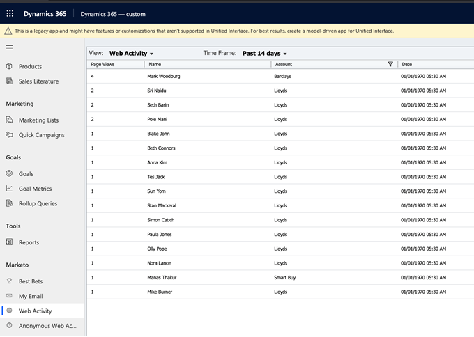

# Atividades da web {#web-activities}

A guia Atividades da Web mostra as atividades da Web de clientes potenciais/contatos.
Revise as atividades da Web mais recentes do seu cliente potencial, citando a contagem de visitas à página e as respectivas contas. Você pode filtrar os resultados para limitar ao número especificado de páginas.

## Atividades da Web anônimas {#anonymous-web-activities}

A guia Atividades Anônimas na Web mostra todas as **atividades anônimas** da Web para visitantes da página da Web. Revise as atividades da Web mais recentes citando a contagem de visitas à página.
