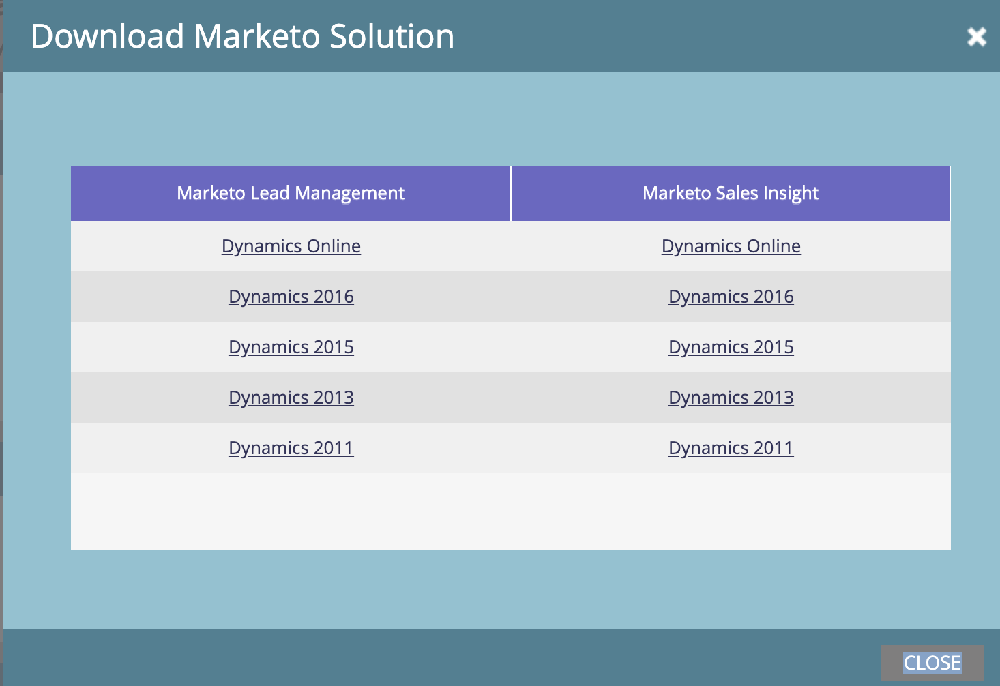

# Baixar a Solução [!DNL Marketo Sales Insight] para [!DNL Microsoft Dynamics] {#download-the-marketo-sales-insight-solution-for-microsoft-dynamics}

>[!NOTE]
>
>**Permissões de administrador são necessárias**

>[!IMPORTANT]
>
>O plug-in nesta página é para quem está sincronizando com o Marketo Engage usando a solução de sincronização do CRM nativa da Marketo para [!DNL Dynamics 365]. Para aqueles que têm: uma sincronização personalizada, [!DNL MS Dynamics 365 Online] (9.x e superior), e compraram [!DNL Marketo Sales Insight], o [pacote está aqui](https://mktg-cdn.marketo.com/community/MarketoSalesInsight_NonNative.zip){target="_blank"}.

1. Vá para a área **[!UICONTROL Administrador]**.

   

1. Clique em **CRM**.

   

1. Selecione **Microsoft**.

   

1. Selecione **[!UICONTROL Baixar Solução da Marketo]**.

   

1. Selecione a solução apropriada para sua versão [!DNL Microsoft Dynamics].

   

Ótimo! Um arquivo zip da solução será baixado no dispositivo.
