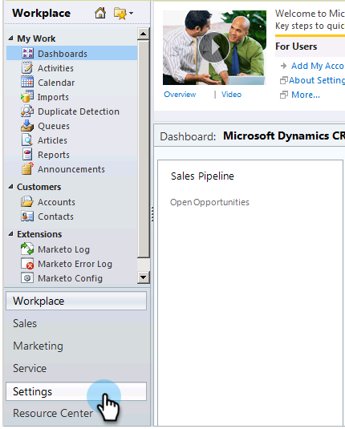

# Instalar e configurar o Marketo Sales Insight no Microsoft Dynamics 2011 {#install-and-configure-marketo-sales-insight-in-microsoft-dynamics}

O Marketo Sales Insight é uma ferramenta fantástica para sua equipe de vendas. Esta é a instrução passo a passo de como instalá-lo e configurá-lo no Microsoft Dynamics 2011 no local.

>[!PREREQUISITES]
>
>Conclua sua integração Marketo-Microsoft.
>
>[Baixe a solução correta](/help/marketo/product-docs/marketo-sales-insight/msi-for-microsoft-dynamics/installing/download-the-marketo-sales-insight-solution-for-microsoft-dynamics.md) para a sua versão do Microsoft Dynamics CRM.

## Importar solução {#import-solution}

1. Entrar no Microsoft Dynamics CRM. Clique em **Configurações** no menu inferior esquerdo.

   

1. Selecione **Soluções** na árvore.

   

1. Clique em **Importar** ( ).

   

   >[!NOTE]
   >
   >Você já deve ter [instalado e configurado](/help/marketo/product-docs/marketo-sales-insight/msi-for-microsoft-dynamics/installing/install-and-configure-marketo-sales-insight-in-microsoft-dynamics-2011.md) a solução da Marketo antes de prosseguir.

1. Clique em **Procurar**. Selecione a solução Marketo Sales Insight que você [baixou](/help/marketo/product-docs/marketo-sales-insight/msi-for-microsoft-dynamics/installing/download-the-marketo-sales-insight-solution-for-microsoft-dynamics.md). Clique em **Avançar**.

   

1. Verifique os detalhes da solução e clique em **Avançar**.

   

1. Verifique se a opção de mensagem do SDK está marcada. Clique em **Avançar**.

   

1. Agora aguarde a conclusão da importação.

   

1. Clique em **Fechar**.

   

1. O Marketo Sales Insight será exibido na lista de soluções. Sim!

   

1. Selecione Marketo Sales Insight e clique em **Todas as personalizações do Publish** ( ).

   

## Conecte o Marketo e o Sales Insight  {#connect-marketo-and-sales-insight}

>[!NOTE]
>
>**Permissões de administrador necessárias**

1. Faça logon no Marketo e clique em **Admin**.

   

1. Na seção **Sales Insight**, clique em **Editar configuração de API**.

   

1. Copie o **Host do Marketo**, a **URL da API** e a **ID de Usuário da API** para usar em uma etapa posterior. Insira uma **Chave secreta de API** de sua escolha e clique em **Salvar**.

   >[!CAUTION]
   >
   >Não use um E comercial (&amp;) na sua chave secreta da API.

   

   >[!NOTE]
   >
   >Os seguintes campos devem ser sincronizados com o Marketo para que _o cliente potencial e o contato_ funcionem:
   >
   >* Prioridade
   >* Urgência
   >* Pontuação relativa
   >
   >Se algum desses campos estiver ausente, você verá uma mensagem de erro no Marketo com o nome dos campos ausentes. Para corrigir isso, execute [este procedimento](/help/marketo/product-docs/marketo-sales-insight/msi-for-microsoft-dynamics/setting-up-and-using/required-fields-for-syncing-marketo-with-dynamics.md).

1. Volte para Dynamics, selecione **Configurações**.

   

1. Selecione **Configuração de API do Marketo** na árvore.

   

1. Clique em **Configuração Padrão**.

   

1. Insira as informações que você obteve da Marketo anteriormente.

   

1. Clique em **Salvar**.

   

## Definir acesso do usuário {#set-user-access}

Configure as funções do usuário para conceder a usuários específicos acesso ao Sales Insight.

1. Selecione **Configurações**.

   

1. Selecione **Administração** na árvore.

   

1. Clique em **Usuários**.

   

1. Selecione os usuários aos quais deseja conceder acesso e clique em **Gerenciar Funções**.

   

1. Selecione a função **Marketo Sales Insight** e clique em **OK**.

   

   E é isso! Todos os usuários com acesso agora poderão ver a seção sales insight na exibição detalhada de lead/contato.

   

   Parabéns. Agora você está liberando todo o potencial do Marketo Sales Insight.

>[!MORELIKETHIS]
>
>[Configurando Estrelas e Chamas para Registros de Cliente Potencial/Contato](/help/marketo/product-docs/marketo-sales-insight/msi-for-microsoft-dynamics/setting-up-and-using/setting-up-stars-and-flames-for-lead-contact-records.md)
