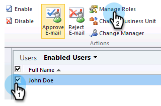

# Instalar e configurar o Marketo Sales Insight no Microsoft Dynamics 2011 {#install-and-configure-marketo-sales-insight-in-microsoft-dynamics}

O Marketo Sales Insight é uma ferramenta fantástica para sua equipe de vendas. Esta é a instrução passo a passo de como instalá-la e configurá-la no Microsoft Dynamics 2011 no local.

>[!PREREQUISITES]
>
>Conclua a integração Marketo-Microsoft.
>
>[Baixe a solução correta](/help/marketo/product-docs/marketo-sales-insight/msi-for-microsoft-dynamics/installing/download-the-marketo-sales-insight-solution-for-microsoft-dynamics.md) para sua versão do Microsoft Dynamics CRM.

## Importar Solução {#import-solution}

1. Faça logon no Microsoft Dynamics CRM. Clique em **Configurações** no menu inferior esquerdo.

   

1. Selecionar **Soluções** na árvore.

   

1. Clique em **Importar** ( ).

   

   >[!NOTE]
   >
   >Você já deveria ter [instalado e configurado](/help/marketo/product-docs/marketo-sales-insight/msi-for-microsoft-dynamics/installing/install-and-configure-marketo-sales-insight-in-microsoft-dynamics-2011.md) a solução Marketo antes de seguir em frente.

1. Clique em **Procurar**. Selecione a solução Marketo Sales Insight que você [baixado](/help/marketo/product-docs/marketo-sales-insight/msi-for-microsoft-dynamics/installing/download-the-marketo-sales-insight-solution-for-microsoft-dynamics.md). Clique em **Próximo**.

   

1. Verifique os detalhes da solução e clique em **Próximo**.

   

1. Verifique se a opção SDK message está marcada. Clique em **Próximo**.

   

1. Agora aguarde a conclusão da importação.

   

1. Clique em **Fechar**.

   

1. O Marketo Sales Insight agora será exibido na lista de soluções. Sim!

   

1. Selecione Marketo Sales Insight e clique em **Publicar todas as personalizações** ( ).

   

## Conectar o Marketo e o Insight de vendas  {#connect-marketo-and-sales-insight}

>[!NOTE]
>
>**Permissões de administrador necessárias**

1. Faça logon no Marketo e clique em **Administrador**.

   

1. Em **Insight de vendas** clique na seção **Editar configuração da API**.

   

1. Copie o **Host Marketo**, **URL da API** e **ID de usuário da API** para uso em uma etapa posterior. Insira um **Chave secreta da API** de sua escolha e clique em **Salvar**.

   >[!CAUTION]
   >
   >Não use um E comercial (&amp;) em sua Chave secreta da API.

   

   >[!NOTE]
   >
   >Os seguintes campos devem ser sincronizados com o Marketo para _Tanto o Cliente Potencial como o Contato_ para que o Sales Insight funcione:
   >
   >* Prioridade
   >* Urgência
   >* Pontuação relativa

   >
   >Se algum desses campos estiver ausente, você verá uma mensagem de erro no Marketo com o nome dos campos ausentes. Para corrigir isso, execute [este procedimento](/help/marketo/product-docs/marketo-sales-insight/msi-for-microsoft-dynamics/setting-up-and-using/required-fields-for-syncing-marketo-with-dynamics.md).

1. Volte para Dynamics, selecione **Configurações**.

   

1. Selecionar **Configuração da API do Marketo** na árvore.

   

1. Clique em **Configuração padrão**.

   

1. Insira as informações obtidas do Marketo anteriormente.

   

1. Clique em **Salvar**.

   

## Definir acesso do usuário {#set-user-access}

Configure as funções de usuário para conceder acesso ao Sales Insight a usuários específicos.

1. Selecionar **Configurações**.

   

1. Selecionar **Administração** na árvore.

   

1. Clique em **Usuários**.

   

1. Selecione os usuários aos quais deseja conceder acesso e clique em **Gerenciar funções**.

   

1. Selecione o **Insight sobre vendas da Marketo** função e clique **OK**.

   

   E é isso! Todos os usuários agora terão acesso à seção sales insight na exibição de detalhes do cliente potencial/contato.

   

   Parabéns. Agora você liberou o poder do Marketo Sales Insight.

>[!MORELIKETHIS]
>
>[Configuração de estrelas e chamas para registros de lead/contato](/help/marketo/product-docs/marketo-sales-insight/msi-for-microsoft-dynamics/setting-up-and-using/setting-up-stars-and-flames-for-lead-contact-records.md)
