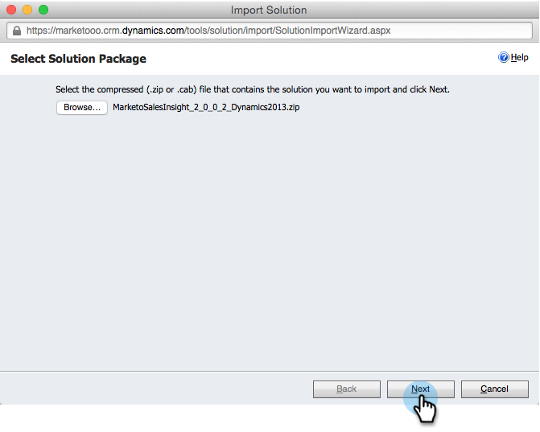

# Instalar e Configurar o [!DNL Marketo Sales Insight] no [!DNL Microsoft Dynamics 2013] {#install-and-configure-marketo-sales-insight-in-microsoft-dynamics}

O [!DNL Marketo Sales Insight] é uma ferramenta fantástica para fornecer à sua equipe de vendas uma &quot;janela&quot; para a riqueza de dados que a equipe de marketing possui. Veja como instalá-lo e configurá-lo.

>[!PREREQUISITES]
>
>Conclua sua integração Marketo-Microsoft.
>
>[Baixe a solução correta](/help/marketo/product-docs/marketo-sales-insight/msi-for-microsoft-dynamics/installing/download-the-marketo-sales-insight-solution-for-microsoft-dynamics.md) para a sua versão do CRM [!DNL Microsoft Dynamics].

## Importar solução {#import-solution}

OK, agora é hora de importar a solução [!DNL Marketo Sales Insight] para o [!DNL Microsoft Dynamics].

1. Em **[!UICONTROL Microsoft Dynamics CRM]**, clique em **[!UICONTROL Configurações]**.

   

1. Em **[!UICONTROL Configurações]**, clique em **[!UICONTROL Personalizações]**.

   

1. Clique em **[!UICONTROL Soluções]**.

   

   >[!NOTE]
   >
   >Você já deve ter instalado e configurado o Marketo antes de prosseguir

1. Clique em **[!UICONTROL Importar]**.

   

1. Na nova janela, clique em **[!UICONTROL Procurar]**.

   

1. Localize e selecione a solução baixada acima.

   

1. Clique em **[!UICONTROL Avançar]**.

   

1. A solução será carregada. Você pode visualizar o conteúdo do pacote se desejar. Clique em **[!UICONTROL Avançar]**.

   

1. Certifique-se de deixar a caixa marcada e clique em **[!UICONTROL Importar]**.

   

1. Sinta-se à vontade para baixar o arquivo de log. Clique em **[!UICONTROL Fechar]**.

   

1. Fantástico! Você deve ver a solução agora. Se não estiver lá, atualize a tela.

   

## Conecte o Marketo e o Sales Insight {#connect-marketo-and-sales-insight}

Vamos vincular sua instância do Marketo a [!DNL Sales Insight] em [!DNL Dynamics].

>[!NOTE]
>
>É necessário ter direitos de administrador.

1. Faça logon no Marketo e vá para a seção **[!UICONTROL Administrador]**.

   

1. Na seção **[!UICONTROL Sales Insight]**, clique em **[!UICONTROL Editar configuração de API]**.

   

1. Copie o **[!UICONTROL Host do Marketo]**, a **[!UICONTROL URL da API]** e a **[!UICONTROL ID de Usuário da API]** para usar em uma etapa posterior. Insira uma **[!UICONTROL Chave secreta de API]** de sua escolha e clique em **[!UICONTROL Salvar]**.

   >[!CAUTION]
   >
   >Não use um E comercial (&amp;) na sua chave secreta da API.

   

   >[!NOTE]
   >
   >Os seguintes campos devem ser sincronizados com o Marketo Insight para que _o cliente potencial e o contato_ funcionem:
   >
   >* Prioridade
   >* Urgência
   >* Pontuação relativa
   >
   >Se algum desses campos estiver ausente, você verá uma mensagem de erro no Marketo com o nome dos campos ausentes. Para corrigir isso, execute [este procedimento](/help/marketo/product-docs/marketo-sales-insight/msi-for-microsoft-dynamics/setting-up-and-using/required-fields-for-syncing-marketo-with-dynamics.md).

1. De volta a [!DNL Microsoft Dynamics], vá para **[!UICONTROL Configurações]**.

   

1. Em **[!UICONTROL Configurações]**, clique em **[!UICONTROL Configuração da API do Marketo]**.

   

1. Clique em **[!UICONTROL Novo]**.

   

1. Insira as informações que você obteve do Marketo anteriormente e clique em **[!UICONTROL Salvar]**.

   

## Definir acesso do usuário {#set-user-access}

Finalmente, você pode conceder a usuários específicos acesso ao [!DNL Marketo Sales Insight].

1. Vá para **[!UICONTROL Configurações]**.

   

1. Clique em **[!UICONTROL Usuários]**.

   

1. Selecione os usuários aos quais você deseja conceder acesso ao Sales Insight e clique em **[!UICONTROL Gerenciar funções]**.

   

1. Selecione a função **[!UICONTROL Marketo Sales Insight]** e clique em **[!UICONTROL OK]**.

   

   E você deveria estar pronto! Finalmente, para testar, faça login no [!DNL Dynamics] como um usuário que tem acesso ao [!DNL Marketo Sales Insight] e olhe um cliente em potencial ou contato.

   

Você desbloqueou a força do [!DNL Marketo Sales Insight] para sua equipe de vendas.

>[!MORELIKETHIS]
>
>[Configurando Estrelas e Chamas para Registros de Cliente Potencial/Contato](/help/marketo/product-docs/marketo-sales-insight/msi-for-microsoft-dynamics/setting-up-and-using/setting-up-stars-and-flames-for-lead-contact-records.md)
