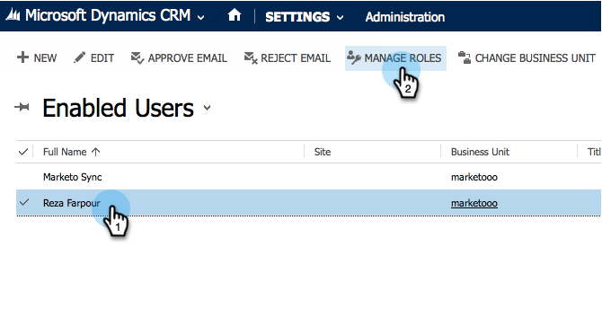

# Instalar e configurar o Marketo Sales Insight no Microsoft Dynamics 2013 {#install-and-configure-marketo-sales-insight-in-microsoft-dynamics}

O Marketo Sales Insight é uma ferramenta fantástica para dar à sua equipe de vendas uma &quot;janela&quot; sobre a riqueza de dados que a equipe de marketing tem. Veja como instalá-lo e configurá-lo.

>[!PREREQUISITES]
>
>Conclua a integração Marketo-Microsoft.
>
>[Baixe a solução correta](/help/marketo/product-docs/marketo-sales-insight/msi-for-microsoft-dynamics/installing/download-the-marketo-sales-insight-solution-for-microsoft-dynamics.md) para sua versão do Microsoft Dynamics CRM.

## Importar Solução {#import-solution}

Ok, agora é hora de importar a solução Marketo Sales Insight para o Microsoft Dynamics.

1. Em **Microsoft Dynamics CRM** click **Configurações**.

   

1. Em **Configurações**, clique em **Personalizações**.

   

1. Clique em **Soluções**.

   

   >[!NOTE]
   >
   >Você já deve ter instalado e configurado o Marketo antes de seguir em frente

1. Clique em **Importar**.

   

1. Na nova janela, clique em **Procurar**.

   

1. Encontre e selecione a solução que você baixou acima.

   

1. Clique em **Próximo**.

   

1. A solução será carregada. Você pode exibir o conteúdo do pacote, se desejar. Clique em **Próximo**.

   

1. Certifique-se de deixar a caixa marcada e clique em **Importar**.

   

1. Você pode baixar o arquivo de log. Clique em **Fechar**.

   

1. Ótimo! Você deve ver a solução agora. Se não estiver lá, atualize a tela.

   

## Conectar o Marketo e o Insight de vendas {#connect-marketo-and-sales-insight}

Vamos vincular sua instância do Marketo ao Sales Insight no Dynamics.

>[!NOTE]
>
>É necessário ter direitos de administrador.

1. Faça logon no Marketo e acesse o **Administrador** seção.

   

1. Em **Insight de vendas** clique na seção **Editar configuração da API**.

   

1. Copie o **Host Marketo**, **URL da API** e **ID de usuário da API** para uso em uma etapa posterior. Insira um **Chave secreta da API** de sua escolha e clique em **Salvar**.

   >[!CAUTION]
   >
   >Não use um E comercial (&amp;) em sua Chave secreta da API.

   

   >[!NOTE]
   >
   >Os seguintes campos devem ser sincronizados com o Marketo para _Tanto o Cliente Potencial como o Contato_ para que o Sales Insight funcione:
   >
   >* Prioridade
   >* Urgência
   >* Pontuação relativa

   >
   >Se algum desses campos estiver ausente, você verá uma mensagem de erro no Marketo com o nome dos campos ausentes. Para corrigir isso, execute [este procedimento](/help/marketo/product-docs/marketo-sales-insight/msi-for-microsoft-dynamics/setting-up-and-using/required-fields-for-syncing-marketo-with-dynamics.md).

1. De volta ao Microsoft Dynamics, acesse **Configurações**.

   

1. Em **Configurações**, clique em **Configuração da API do Marketo**.

   

1. Clique em **Novo**.

   

1. Insira as informações obtidas do Marketo anteriormente e clique em **Salvar**.

   

## Definir acesso do usuário {#set-user-access}

Por fim, você pode conceder acesso a usuários específicos ao Marketo Sales Insight.

1. Ir para **Configurações**.

   

1. Clique em **Usuários**.

   

1. Selecione os usuários aos quais deseja conceder acesso ao Sales Insight e clique **Gerenciar funções**.

   

1. Selecione o **Insight sobre vendas da Marketo** função e clique **OK**.

   

   E você deveria estar pronto! Por fim, para testar, faça logon no Dynamics como um usuário que tem acesso ao Marketo Sales Insight e olhe um cliente potencial ou contato.

   

Agora você desbloqueou o poder do Marketo Sales Insight para sua equipe de vendas.

>[!MORELIKETHIS]
>
>[Configuração de estrelas e chamas para registros de lead/contato](/help/marketo/product-docs/marketo-sales-insight/msi-for-microsoft-dynamics/setting-up-and-using/setting-up-stars-and-flames-for-lead-contact-records.md)
