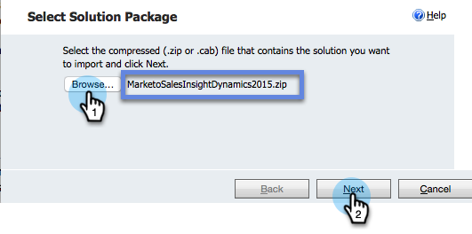

# Instalar e Configurar o [!DNL Marketo Sales Insight] no [!DNL Microsoft Dynamics 365] {#install-and-configure-marketo-sales-insight-in-microsoft-dynamics}

O [!DNL Marketo Sales Insight] é uma ferramenta fantástica para fornecer à sua equipe de vendas uma &quot;janela&quot; para a riqueza de dados que a equipe de marketing possui. Veja como instalar e configurar.

>[!PREREQUISITES]
>
>Conclua sua integração Marketo-Microsoft.
>
>[Baixe a solução correta](/help/marketo/product-docs/marketo-sales-insight/msi-for-microsoft-dynamics/installing/download-the-marketo-sales-insight-solution-for-microsoft-dynamics.md) para a sua versão do [!DNL Microsoft Dynamics CRM].

## Importar solução {#import-solution}

1. Faça logon em [[!DNL Microsoft Office 365]](https://login.microsoftonline.com/).

   

1. Clique no menu  e selecione **CRM**.

   

1. Clique no menu . Na lista suspensa, selecione **[!DNL Settings]** e, em seguida, **[!DNL Solutions]**.

   

   >[!NOTE]
   >
   >Você já deve ter o [instalado e configurado a solução da Marketo](/help/marketo/product-docs/crm-sync/microsoft-dynamics-sync/sync-setup/microsoft-dynamics-365-with-ropc-connection/step-1-of-4-install.md) antes de prosseguir.

1. Clique em **[!UICONTROL Importar]**.

   

1. Na nova janela, clique em **[!UICONTROL Procurar]**. Escolha a solução [Marketo Sales Insight baixada na etapa 1](#msi). Clique em **[!UICONTROL Avançar]**.

   

1. A solução será carregada. Você pode visualizar o conteúdo do pacote se desejar. Clique em **[!UICONTROL Avançar]**.

   

1. Certifique-se de deixar a caixa **[!UICONTROL marcada]** e clique em **[!UICONTROL Importar]**.

   

1. Sinta-se à vontade para baixar o arquivo de log. Clique em **[!UICONTROL Fechar]**.

   

1. Fantástico! Você deve ver a solução agora. Se não estiver lá, atualize a tela.

   

1. Clique em **[!UICONTROL Publicar todas as personalizações]**.

   

## Conectar o Marketo e o [!DNL Sales Insight] {#connect-marketo-and-sales-insight}

Vamos vincular sua instância do Marketo a [!DNL Sales Insight] em [!DNL Dynamics]. Veja como:

>[!NOTE]
>
>**Permissões de administrador necessárias**

1. Faça logon no Marketo e vá para a seção **[!UICONTROL Administrador]**.

   

1. Na seção **[!UICONTROL Sales Insight]**, clique em **Editar configuração de API**.

   

1. Copie o **[!UICONTROL Host do Marketo]**, a **[!UICONTROL URL da API]** e a **[!UICONTROL ID de Usuário da API]** para usar em uma etapa posterior. Insira uma **[!UICONTROL Chave secreta de API]** de sua escolha e clique em **[!UICONTROL Salvar]**.

   >[!CAUTION]
   >
   >Não use um E comercial (&amp;) na sua chave secreta da API.

   

   >[!NOTE]
   >
   >Os campos a seguir devem ser sincronizados com o Marketo para que _o Cliente Potencial e o Contato_ funcionem:[!DNL Sales Insight]
   >
   > * Prioridade
   > * Urgência
   > * Pontuação relativa
   >
   >Se algum desses campos estiver ausente, você verá uma mensagem de erro no Marketo com o nome dos campos ausentes. Para corrigir isso, execute [este procedimento](/help/marketo/product-docs/marketo-sales-insight/msi-for-microsoft-dynamics/setting-up-and-using/required-fields-for-syncing-marketo-with-dynamics.md).

1. De volta a [!DNL Microsoft Dynamics], clique no ícone  ao lado de [!UICONTROL Configurações] e selecione **[!UICONTROL Configuração de API do Marketo]** na lista suspensa.

   

1. Clique em **[!UICONTROL Configuração Padrão]**.

   

1. Insira as informações que você copiou do Marketo anteriormente.

   

1. Clique no ícone  no canto inferior direito para salvar as alterações.

## Definir acesso do usuário {#set-user-access}

Você precisa conceder permissões aos usuários para usar o [!DNL Sales Insight].

1. Clique no menu . No menu suspenso, selecione **[!UICONTROL Configurações]** e **[!UICONTROL Segurança]**.

   

1. Clique em **[!UICONTROL Usuários]**.

   

1. Selecione os usuários aos quais você deseja conceder acesso a [!DNL Sales Insight] e clique em **[!UICONTROL Gerenciar Funções]**.

   

1. Selecione a função **[!UICONTROL Marketo Sales Insight]** e clique em **[!UICONTROL OK]**.

   

   E você deveria estar pronto! Finalmente, para testar, faça login no [!DNL Dynamics] como um usuário que tem acesso ao [!DNL Marketo Sales Insight] e olhe um cliente em potencial ou contato.

   

Você desbloqueou a força do [!DNL Marketo Sales Insight] para sua equipe de vendas.

>[!MORELIKETHIS]
>
>[Configurando Estrelas e Chamas para Registros de Cliente Potencial/Contato](/help/marketo/product-docs/marketo-sales-insight/msi-for-microsoft-dynamics/setting-up-and-using/setting-up-stars-and-flames-for-lead-contact-records.md)
