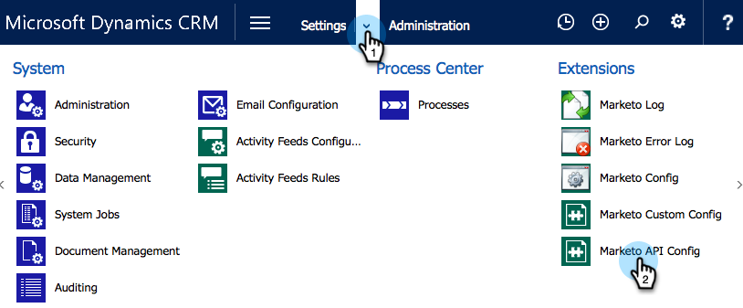

# Instalar e configurar o Marketo Sales Insight no Microsoft Dynamics 365 {#install-and-configure-marketo-sales-insight-in-microsoft-dynamics}

O Marketo Sales Insight é uma ferramenta fantástica para fornecer à sua equipe de vendas uma &quot;janela&quot; para a riqueza de dados que a equipe de marketing possui. Veja como instalar e configurar.

>[!PREREQUISITES]
>
>Conclua sua integração Marketo-Microsoft.
>
>[Baixar a solução correta](/help/marketo/product-docs/marketo-sales-insight/msi-for-microsoft-dynamics/installing/download-the-marketo-sales-insight-solution-for-microsoft-dynamics.md) para a sua versão do Microsoft Dynamics CRM.

## Importar solução {#import-solution}

1. Efetue logon no [Microsoft Office 365](https://login.microsoftonline.com/).

   

1. Clique em  e selecione **CRM**.

   

1. Clique em  menu. No menu suspenso, selecione **Configurações** e selecione **Soluções**.

   

   >[!NOTE]
   >
   >Você já deve ter [solução Marketo instalada e configurada](/help/marketo/product-docs/crm-sync/microsoft-dynamics-sync/sync-setup/microsoft-dynamics-365-with-ropc-connection/step-1-of-4-install.md) antes de avançar.

1. Clique em **Importar**.

   

1. Na nova janela, clique em **Procurar**. Escolha o [Solução Marketo Sales Insight que você baixou na etapa 1](#msi). Clique em **Próxima**.

   

1. A solução será carregada. Você pode visualizar o conteúdo do pacote se desejar. Clique em **Próxima**.

   

1. Certifique-se de sair da caixa **marcado** e clique em **Importar**.

   

1. Sinta-se à vontade para baixar o arquivo de log. Clique em **Fechar**.

   

1. Ótimo! Você deve ver a solução agora. Se não estiver lá, atualize a tela.

   

1. Clique em **Publicar todas as personalizações**.

   

## Conecte o Marketo e o Sales Insight {#connect-marketo-and-sales-insight}

Vamos vincular sua instância do Marketo ao Sales Insight in Dynamics. Veja como:

>[!NOTE]
>
>**Permissões de administrador necessárias**

1. Faça logon no Marketo e acesse o **Admin** seção.

   

1. No **Sales Insight** clique em **Editar configuração da API**.

   

1. Copie o **Host do Marketo**, **URL da API** e **ID de usuário da API** para uso em uma etapa posterior. Insira um **Chave secreta da API** de sua escolha e clique em **Salvar**.

   >[!CAUTION]
   >
   >Não use um E comercial (&amp;) na sua chave secreta da API.

   

   >[!NOTE]
   >
   >Os seguintes campos devem ser sincronizados com o Marketo para _Cliente Potencial e Contato_ para que o Sales Insight funcione:
   >
   > * Prioridade
   > * Urgência
   > * Pontuação relativa
   >
   >Se algum desses campos estiver ausente, você verá uma mensagem de erro no Marketo com o nome dos campos ausentes. Para corrigir isso, execute [este procedimento](/help/marketo/product-docs/marketo-sales-insight/msi-for-microsoft-dynamics/setting-up-and-using/required-fields-for-syncing-marketo-with-dynamics.md).

1. De volta ao Microsoft Dynamics, clique no link  ícone ao lado de Configurações e selecione **Configuração da API do Marketo** na lista suspensa.

   

1. Clique em **Configuração padrão**.

   

1. Insira as informações que você copiou do Marketo anteriormente.

   

1. Clique em  no canto inferior direito para salvar as alterações.

## Definir acesso do usuário {#set-user-access}

Você precisa conceder permissões aos usuários para usar o Sales Insight.

1. Clique em  menu. No menu suspenso, selecione **Configurações** e selecione **Segurança**.

   

1. Clique em **Usuários**.

   

1. Selecione os usuários aos quais você deseja conceder acesso ao Sales Insight e clique em **Gerenciar Funções**.

   

1. Selecione o **Marketo Sales Insight** e clique em **OK**.

   

   E você deveria estar pronto! Por fim, para testar, faça logon no Dynamics como um usuário com acesso ao Marketo Sales Insight e veja um cliente potencial ou contato.

   

Agora você desbloqueou o potencial do Marketo Sales Insight para sua equipe de vendas.

>[!MORELIKETHIS]
>
>[Configuração de Estrelas e Chamas para Registros de Cliente Potencial/Contato](/help/marketo/product-docs/marketo-sales-insight/msi-for-microsoft-dynamics/setting-up-and-using/setting-up-stars-and-flames-for-lead-contact-records.md)
