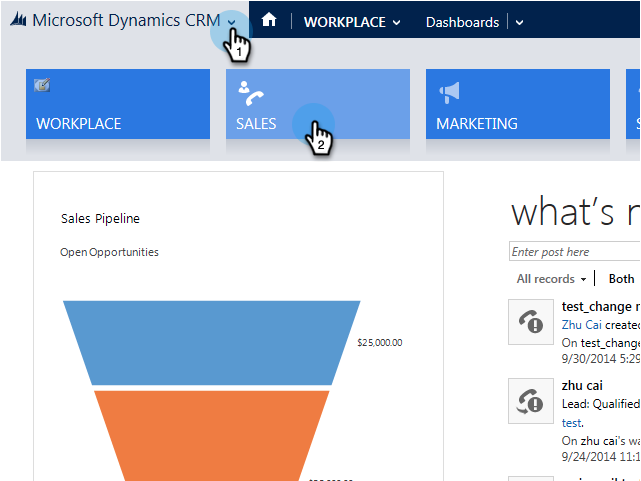

# Adicionar um cliente potencial/contato a uma campanha do Marketo no Microsoft Dynamics {#add-a-lead-contact-to-a-marketo-campaign-from-microsoft-dynamics}

Você pode adicionar leads/contatos às campanhas inteligentes do Marketo de forma rápida e fácil diretamente do Microsoft Dynamics. Veja como.

1. No Dynamics, vá para a área **Vendas**.

   

1. Selecione uma exibição.

   

1. Selecione um ou mais clientes potenciais ou contatos.

   

1. Clique em **...** e selecione **Adicionar ao Marketo Campaign**.

   

1. Selecione a campanha do Marketo à qual você deseja adicionar clientes potenciais ou contatos e clique em **Adicionar**.

   

   >[!NOTE]
   >
   >Para que a campanha apareça na lista suspensa, use o acionador [**Campanha solicitada**](/help/marketo/product-docs/core-marketo-concepts/smart-campaigns/using-smart-campaigns/setting-up-a-trigger-smart-campaign-for-sales-using-campaign-is-requested.md), com o Sales Insight como origem, ao configurar a campanha.

E isso é tudo, pessoal! Agora você tem o poder das campanhas inteligentes do Marketo diretamente do Dynamics.
