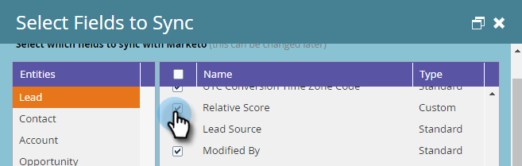

# Campos obrigatórios para sincronização do Marketo com o Dynamics {#required-fields-for-syncing-marketo-with-dynamics}

Estes campos *devem* ser sincronizados com a Marketo para que o cliente potencial e o contato do Sales Insight funcionem:

* Prioridade
* Urgência
* Pontuação relativa

Se algum desses campos estiver ausente, você verá uma mensagem de erro no Marketo com o nome dos campos ausentes. Para corrigir isso, verifique sua instância para ter certeza de que os campos estão sincronizados para **Lead** e **Contato**. Caso contrário, adicione-os.

Veja como verificar e adicionar campos de sincronização.

1. Vá para Admin e clique em **Microsoft Dynamics**.

   

1. Clique em **Editar** em Detalhes da Sincronização de Campo.

   

1. Em Lead, marque a caixa de seleção Prioridade.

   

1. Agora, role para baixo e marque a caixa de seleção Urgência...

   

1. ...e a caixa de seleção Pontuação relativa.

   

1. Em seguida, marque as caixas de seleção Prioridade, Urgência e Pontuação relativa para contato.

   

1. Clique em **Salvar**.

   

>[!NOTE]
>
>Aguarde pelo menos 10 minutos para que uma sincronização seja executada antes de verificar se você corrigiu o problema.

>[!MORELIKETHIS]
>
>[Configurando Estrelas e Chamas para Registros de Cliente Potencial/Contato](/help/marketo/product-docs/marketo-sales-insight/msi-for-microsoft-dynamics/setting-up-and-using/setting-up-stars-and-flames-for-lead-contact-records.md)
