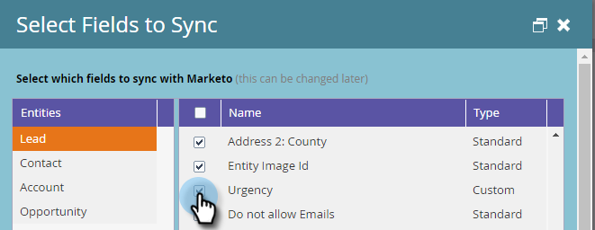

# Campos obrigatórios para sincronizar o Marketo com o Dynamics {#required-fields-for-syncing-marketo-with-dynamics}

Esses campos *must* ser sincronizado com a Marketo para que o Lead e o Contato para o Insight de vendas funcionem:

* Prioridade
* Urgência
* Pontuação relativa

Se algum desses campos estiver ausente, você verá uma mensagem de erro no Marketo com o nome dos campos ausentes. Para corrigir isso, verifique em sua instância para ter certeza de que os campos estão sincronizados para ambos **Líder** e **Contato**. Caso contrário, adicione-os.

Veja como verificar e adicionar campos de sincronização.

1. Acesse Admin e clique em **Microsoft Dynamics**.

   

1. Clique em **Editar** em Detalhes de sincronização de campo.

   

1. Em Lead, marque a caixa de seleção Prioridade .

   

1. Agora, role para baixo e marque a caixa de seleção Urgência ...

   

1. ...e a caixa de seleção Pontuação relativa .

   

1. Em seguida, marque as caixas de seleção Prioridade, Urgência e Pontuação relativa para contato.

   

1. Clique em **Salvar**.

   

>[!NOTE]
>
>Aguarde pelo menos 10 minutos para que a sincronização seja executada antes de verificar se você corrigiu o problema.

>[!MORELIKETHIS]
>
>[Configuração de estrelas e chamas para registros de lead/contato](/help/marketo/product-docs/marketo-sales-insight/msi-for-microsoft-dynamics/setting-up-and-using/setting-up-stars-and-flames-for-lead-contact-records.md)
