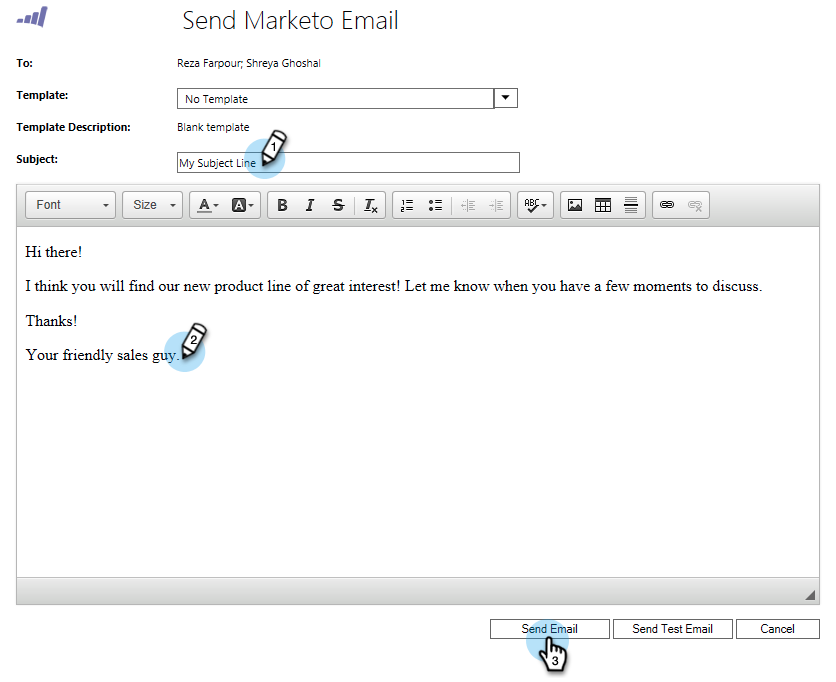

# Enviar um email do [!DNL Marketo Sales] de [!DNL Microsoft Dynamics] {#send-a-marketo-sales-email-from-microsoft-dynamics}

Sua equipe de vendas pode enviar emails e rastreá-los para aberturas e cliques diretamente de dentro do [!DNL Microsoft Dynamics]. Veja como.

1. Em [!DNL Dynamics], vá para a área **[!UICONTROL Vendas]**.

   

1. Selecione uma **[!UICONTROL Exibição de Sistema]**.

   

1. Selecione um ou mais clientes em potencial.

   

1. Clique na guia **...** e em **[!UICONTROL Enviar Email do Marketo]**.

   

   >[!TIP]
   >
   >Você pode [publicar emails como modelos](/help/marketo/product-docs/marketo-sales-insight/msi-for-salesforce/features/actions-in-the-msi-panel/send-marketo-email/publish-an-email-to-sales-insight.md) para a equipe de vendas usar.

1. Adicione um assunto, escreva seu email e clique em **[!UICONTROL Enviar Email]**. (Escolha um template se precisar de um.)

   

   >[!TIP]
   >
   >Você pode clicar em **Enviar Email de Teste** primeiro e o email será enviado a você (endereço de email principal no Microsoft Dynamics) antes do envio do email real.

   >[!NOTE]
   >
   >Você pode enviar até 300 emails do Marketo de cada vez.

Muito bem! Agora você sabe como enviar emails rastreados do Marketo diretamente do [!DNL Microsoft Dynamics].

>[!MORELIKETHIS]
>
>[Adicionar um Cliente Potencial/Contato a uma Campanha do Marketo de [!DNL Microsoft Dynamics]](/help/marketo/product-docs/marketo-sales-insight/msi-for-microsoft-dynamics/setting-up-and-using/add-a-lead-contact-to-a-marketo-campaign-from-microsoft-dynamics.md)
