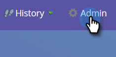

# Desabilitar Sincronização Global [!DNL MS Dynamics] {#disable-global-ms-dynamics-sync}

Siga estas etapas simples para desabilitar a sincronização do [!DNL MS Dynamics].

1. No Marketo, clique em **[!UICONTROL Admin]**.

   

1. Em [!UICONTROL Integração], clique em **[!UICONTROL Microsoft Dynamics]**.

   

1. Clique em **[!UICONTROL Desabilitar sincronização]**.

   

   >[!NOTE]
   >
   >Se você não vir o botão [!UICONTROL Desabilitar Sincronização] em sua instância, contate o [Suporte da Marketo](https://nation.marketo.com/t5/Support/ct-p/Support).
