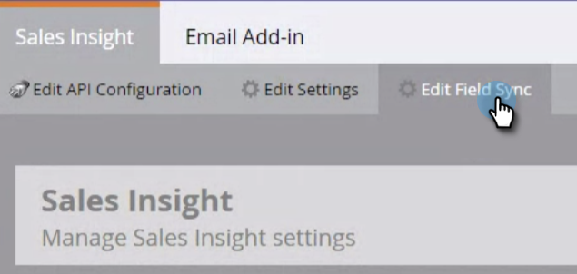

# Desinstalar o MSI da instância do MS [!DNL Dynamics] {#uninstall-msi-from-your-ms-dynamics-instance}

Para desinstalar o MSI da instância do MS [!DNL Dynamics], você precisará executar etapas no Marketo e no MS [!DNL Dynamics].

>[!PREREQUISITES]
>
>[Desabilitar MS [!DNL Dynamics] Sincronização](/help/marketo/product-docs/marketo-sales-insight/msi-for-microsoft-dynamics/uninstalling/disable-global-ms-dynamics-sync.md) Global

1. No Marketo, clique em **[!UICONTROL Admin]**.

   

1. Clique em **[!UICONTROL Sales Insight]**.

   

1. Clique em **[!UICONTROL Editar sincronização de campo]**.

   

1. Marque a caixa de seleção **[!UICONTROL Desabilitar sincronização]** e clique em **[!UICONTROL Salvar]**.

   >[!NOTE]
   >
   >Certifique-se de [desabilitar a Sincronização Global do MS Dynamics](/help/marketo/product-docs/marketo-sales-insight/msi-for-microsoft-dynamics/uninstalling/disable-global-ms-dynamics-sync.md) antes de desabilitar a sincronização de campo.

   

## As seguintes etapas ocorrem na instância do MS [!DNL Dynamics]: {#the-following-steps-take-place-in-your-ms-dynamics-instance}

1. Clique em **[!UICONTROL Configurações avançadas]**.

1. Clique em **[!UICONTROL Soluções]**.

1. Selecione **[!UICONTROL Marketo Sales Insight]** e clique no ícone excluir.

1. Quando o modal Desinstalar Solução aparecer, clique em **[!UICONTROL OK]**.

   Geralmente leva cerca de 20 minutos para que a solução MS [!DNL Dynamics] seja totalmente desinstalada. No entanto, se você tiver uma instância grande do MS [!DNL Dynamics], pode demorar um pouco mais.

   >[!NOTE]
   >
   >Lembre-se de ativar a sincronização Global do MS [!DNL Dynamics] depois de desinstalar o MSI.
