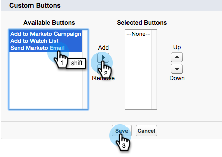

# Adicionar Botões de Ação em Massa ao [!DNL Salesforce] Classic{#add-bulk-action-buttons-to-salesforce-classic}

Você pode adicionar botões Marketo aos seus Layouts do [!DNL Salesforce]. Veja um exemplo:

1. Clique em **[!UICONTROL Instalação]**. Pesquise por &quot;[!UICONTROL layout de pesquisa]&quot; e clique em **[!UICONTROL Layouts de Pesquisa]** em **[!UICONTROL Clientes potenciais]**.

   

1. Clique em **[!UICONTROL Editar]** na **[!UICONTROL Exibição da lista de clientes potenciais]** linha.

   

1. Adicione **[!UICONTROL Adicionar à Campanha do Marketo]**, **[!UICONTROL Enviar Email do Marketo]** e **[!UICONTROL Adicionar à Lista de Interesse]** aos **[!UICONTROL Botões Selecionados]** e **[!UICONTROL Salvar]**.

   

   >[!TIP]
   >
   >Mantenha pressionada a tecla Shift para selecionar todos os três botões de uma só vez.

1. Repita essas etapas para seus Contatos (todos os três botões) e Contas (apenas um botão: Adicionar à Lista de Controle).

   >[!NOTE]
   >
   >Não é possível adicionar botões do Marketo a Oportunidades.
