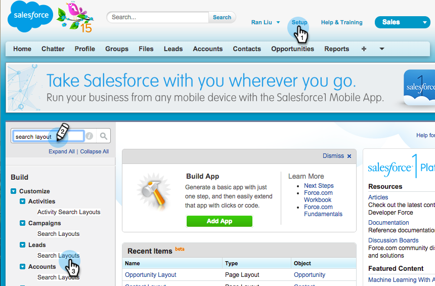

# Adicionar botões de ação em massa ao Salesforce Classic{#add-bulk-action-buttons-to-salesforce-classic}

Você pode adicionar botões Marketo aos seus layouts do Salesforce. Veja um exemplo:

1. Clique em **Configuração**. Procure por &quot;layout de pesquisa&quot; e clique no botão **Pesquisar Layouts** under **Clientes potenciais**.

   

1. Clique em **Editar** no **Exibição da Lista de Clientes Potenciais** linha.

   

1. Adicionar **Adicionar ao Marketo Campaign**, **Enviar email do Marketo** e **Adicionar à lista de monitoramento** botões para **Botões Selecionados** e **Salvar**.

   

   >[!TIP]
   >
   >Mantenha pressionada a tecla Shift para selecionar todos os três botões ao mesmo tempo.

1. Repita essas etapas para seus Contatos (todos os três botões) e Contas (apenas um botão: Adicionar à lista de monitoramento).

   >[!NOTE]
   >
   >Não é possível adicionar botões Marketo a Oportunidades.
