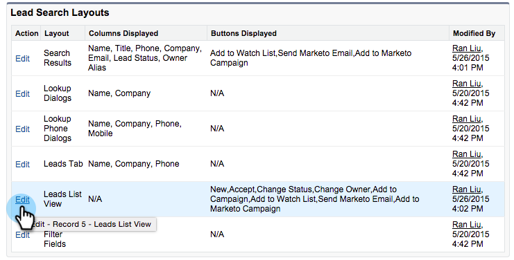

# Adicionar botões de ação em massa ao Salesforce Classic{#add-bulk-action-buttons-to-salesforce-classic}

Você pode adicionar botões do Marketo aos seus Layouts do Salesforce. Veja um exemplo:

1. Clique em **Instalação**. Procure por &quot;layout de pesquisa&quot; e clique em **Layouts de Pesquisa** em **Clientes Potenciais**.

   

1. Clique em **Editar** na **Exibição da lista de clientes potenciais** linha.

   

1. Adicione **Adicionar à Campanha do Marketo**, **Enviar Email do Marketo** e **Adicionar à Lista de Interesse** aos **Botões Selecionados** e **Salvar**.

   

   >[!TIP]
   >
   >Mantenha pressionada a tecla Shift para selecionar todos os três botões de uma só vez.

1. Repita essas etapas para seus Contatos (todos os três botões) e Contas (apenas um botão: Adicionar à Lista de Controle).

   >[!NOTE]
   >
   >Não é possível adicionar botões do Marketo a Oportunidades.
