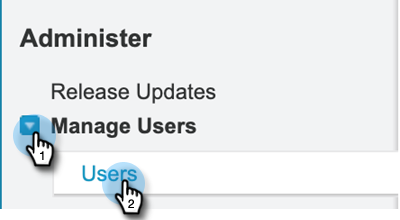

# Adicionar conjunto de permissões do Sales Insight {#add-sales-insight-permission-set}

Use as etapas a seguir para adicionar acesso aos recursos do Sales Insight no Salesforce. Aplicável ao Salesforce Classic e Lighining

>[!PREREQUISITES]
>
>[Atualize seu pacote Sales Insight Salesforce](/help/marketo/product-docs/marketo-sales-insight/msi-for-salesforce/upgrading/upgrading-your-msi-package.md){target="_blank"} para a versão 1.8000 ou superior para usar este recurso.

>[!IMPORTANT]
>
>Se você tiver concedido anteriormente ao Sales Insight acesso a todos os perfis e/ou implementado o Sales Insight para todos os usuários, você deve [remover o acesso em nível de perfil](/help/marketo/product-docs/marketo-sales-insight/msi-for-salesforce/configuration/remove-sales-insight-access.md){target="_blank"} para usar este conjunto de permissões.

## Visão geral {#overview}

A permissão &quot;Aplicativo Marketo&quot; faz parte do pacote Sales Insight Salesforce. Inclui acesso aos objetos mencionados abaixo, classes apex e páginas de força visual. Elas são necessárias para acessar todos os recursos do Sales Insight.

**Configurações do objeto**

<table> 
 <tbody> 
 <tr> 
   <td>BestBetsCache</td> 
   <td>Ler, Criar, Editar, Deletar, Exibir Tudo, Modificar Tudo</td> 
  </tr> 
  <tr> 
   <td>Detalhes de melhores opções</td> 
   <td>Ler, Criar, Editar, Deletar, Exibir Tudo, Modificar Tudo</td> 
  </tr> 
  <tr> 
   <td>Exibições de Melhores Opções</td> 
   <td>Ler, Criar, Editar, Deletar, Exibir Tudo, Modificar Tudo</td> 
  </tr> 
  <tr> 
   <td>EmailActivityCache</td> 
   <td>Ler, Criar, Editar, Deletar, Exibir Tudo, Modificar Tudo</td> 
  </tr> 
  <tr> 
   <td>GetMethodArgus</td> 
   <td>Ler, Criar, Editar, Deletar, Exibir Tudo, Modificar Tudo</td> 
  </tr> 
  <tr> 
   <td>GroupedWebActivityCache</td> 
   <td>Ler, Criar, Editar, Deletar, Exibir Tudo, Modificar Tudo</td> 
  </tr> 
  <tr> 
   <td>InterestingMomentsCache</td> 
   <td>Ler, Criar, Editar, Deletar, Exibir Tudo, Modificar Tudo</td> 
  </tr> 
  <tr> 
   <td>Config. do Marketo Sales Insight</td> 
   <td>Ler, Criar, Editar, Deletar, Exibir Tudo, Modificar Tudo</td> 
  </tr> 
  <tr> 
   <td>ScoringCache</td> 
   <td>Ler, Criar, Editar, Deletar, Exibir Tudo, Modificar Tudo</td> 
  </tr> 
  <tr> 
   <td>Valores</td> 
   <td>Ler, Criar, Editar, Deletar, Exibir Tudo, Modificar Tudo</td> 
  </tr> 
  <tr> 
   <td>WebActivityCache</td> 
   <td>Ler, Criar, Editar, Deletar, Exibir Tudo, Modificar Tudo</td> 
  </tr> 
 </tbody> 
</table>

* Acesso à classe Apex: 159 classes Apex que começam com &quot;mkto_si&quot;
* Acesso à página do Visualforce: 64 páginas do Visualforce que começam com &quot;mkto_si&quot;
* Definições de configuração personalizada: mkto_si.Configurações do Marketo &amp; mkto_si.Preferências do usuário

## Adicionar o conjunto de permissões do aplicativo Marketo aos usuários {#adding-marketo-app-permission-set-to-users}

1. Faça logon em sua conta do Salesforce.

1. Clique em **Instalação**.

   

1. Em Administrador, clique para desencaminhar **Gerenciar Usuários** e depois **Usuários**.

   

1. Em Todos os usuários, selecione o usuário ao qual deseja fornecer acesso e clique em **Atribuições de conjunto de permissões**.

   

1. Clique em **Editar atribuições**.

   

1. Selecione **Acesso ao Aplicativo Marketo** nos conjuntos de permissões disponíveis e **Adicionar**. Clique em **Salvar**.

   

1. Agora, ao rolar para baixo na página Detalhes do usuário, você verá &quot;Acesso ao aplicativo Marketo&quot; em Atribuições de conjunto de permissões.

   

>[!NOTE]
>
>Os usuários que não têm acesso ao Sales Insight verão esta mensagem: &quot;Você não tem privilégios suficientes para acessar esta guia&quot;.

Pronto! Você adicionou com sucesso o acesso ao Sales Insight. Repita as mesmas etapas para qualquer outro perfil ao qual deseje adicionar acesso.
