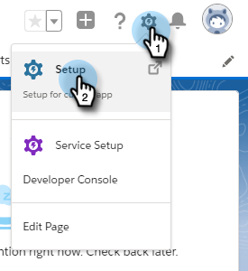

# Ações em massa em [!DNL Salesforce Lightning] {#bulk-actions-in-salesforce-lightning}

Veja como configurar ações em massa no [!DNL Salesforce Lightning].

1. Em [!DNL Salesforce], clique no ícone Instalação e selecione **[!UICONTROL Instalação]**.

   

1. Clique na guia **[!UICONTROL Gerenciador de objetos]**.

   

1. Localize e selecione o rótulo **[!UICONTROL Lead]**.

   

1. Clique em **[!UICONTROL Pesquisar Layouts do Salesforce Classic]**.

   

   Localize o layout Exibição em lista. Clique na lista suspensa à direita e selecione **[!UICONTROL Editar]**.

   

1. Em Botões Personalizados, localize e selecione **[!UICONTROL Adicionar ao Marketo Campaign (lightning)]** e **[!UICONTROL Enviar Email do Marketo (lightning)]**. Clique no botão **[!UICONTROL Adicionar]**.

   

1. Clique em **[!UICONTROL Salvar]**.

   

   Agora é possível ver botões de ação em massa na Exibição da lista de clientes potenciais.

   >[!NOTE]
   >
   >Repita as mesmas etapas para adicionar ações em massa na exibição da Lista de contatos.
