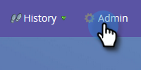

# Configuração para clientes existentes {#configuration-for-existing-customers}

Defina a seguinte configuração para começar a usar o novo Painel de insights.

>[!PREREQUISITES]
>
>Atualize seu pacote do Salesforce para a versão mais recente

## Configurar o Sales Insight no Marketo {#configure-sales-insight-in-marketo}

1. Abra uma nova guia em seu navegador para obter as credenciais do Marketo Sales Insights de sua conta da Marketo.

1. Vá para a área **Administrador**.

   

1. Clique em **Sales Insight**.

   

1. Clique em **Exibir** para preencher as credenciais da API Rest.

   

1. Você verá um pop-up de confirmação. Clique em **OK**.

## Configurar o Sales Insight no Salesforce {#configure-sales-insight-in-salesforce}

1. No Salesforce, clique em **Configurar**.

   

1. Procure e selecione **Configurações de Site Remoto**.

   

1. Clique em **Novo Site Remoto**.

   

1. Insira o Nome do site remoto (pode ser algo como &quot;MarketoRestAPI&quot;) e o URL do site remoto (o URL da API no painel Configuração da API Rest no Marketo).

   

1. Clique em **Salvar**.

   

   Agora você criou a configuração de site remoto para a API Rest.

## Acessar Marketo Sales Insight {#access-marketo-sales-insight}

1. Copie as credenciais do painel API Rest na página Admin de insights de vendas da Marketo. Cole-os na seção API Rest na página Configuração do Sales Insight do Salesforce.

1. Insira a chave secreta da API.

   
