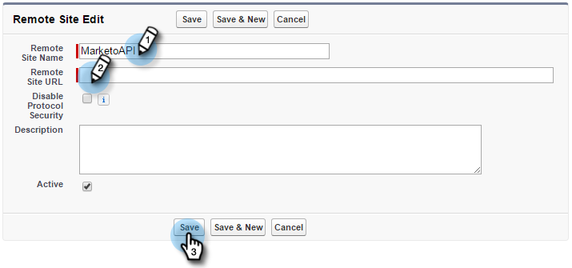
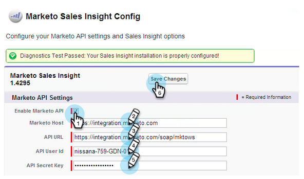

# Configurar o Marketing to Sales Insight no Salesforce Enterprise/Unlimited {#configure-marketo-sales-insight-in-salesforce-enterprise-unlimited}

Estas são as etapas necessárias para configurar o Marketing to Sales Insight no Salesforce Enterprise/Unlimited Editions. Vamos começar.

>[!NOTE]
>
>**Pré-requisitos**
>
>* [Configurar a sincronização de campos do Marketing em seu Salesforce Enterprise/Unlimited Edition](http://docs.marketo.com/pages/viewpage.action?pageid=2360372)
>* [Instalar o pacote de insight de vendas do Marketing Cloud na AppExchange do Salesforce](../../../../product-docs/marketo-sales-insight/msi-for-salesforce/installation/install-marketo-sales-insight-package-in-salesforce-appexchange.md)

>

>[!NOTE]
>
>**Permissões de administrador necessárias**

## Configurar insight de vendas no Marketing {#configure-sales-insight-in-marketo}

1. Abra uma nova janela do navegador para obter as credenciais do Marketing Insight de vendas da sua conta de Marketing.
1. Vá para a área Admin e selecione **Sales Insight**.

   

1. Clique em **Editar configuração** da API.

   

1. Digite uma chave secreta da API de sua escolha e clique em **Salvar**. NÃO use um E comercial (&amp;) em sua chave secreta da API.

   

   >[!NOTE]
   >
   >Sua chave secreta da API é como uma senha para sua organização e deve ser segura.

1. Clique em **Visualização** no painel Restaurar configuração da API para preencher as credenciais.

   

1. Você verá um pop-up de confirmação. Clique em **OK**.

   

## Configurar insight de vendas no Salesforce {#configure-sales-insight-in-salesforce}

1. No Salesforce, clique em **Configuração**.

   

1. Procure &quot;site remoto&quot; e selecione Configurações **de site** remoto.

   

1. Clique em **Novo site** remoto.

   

1. Digite o Nome do site remoto (pode ser algo como &quot;MarketoSoapAPI&quot;). Insira o URL do site remoto, que é o URL do host do Marketo no painel Configuração da API Soap no Marketo. Clique em **Salvar**. Agora você criou configurações de site remoto para a API Soap.

   

1. Clique novamente em **Novo site** remoto.

   

1. Digite o Nome do site remoto (pode ser algo como &quot;MarketoRestAPI&quot;). Insira o URL do site remoto, que é o URL da sua API no painel Restaurar configuração da API no Marketo. Clique em **Salvar**. Agora você criou configurações de site remoto para a Rest API.

## Configurar o Marketing to Sales Insight {#set-up-marketo-sales-insight}

1. Faça logon na sua instância do Marketo e clique em **Admin**.

   

1. Clique em** Sales Insight**.

   

1. Clique em **Editar configuração** da API.

   

1. Digite uma chave **secreta da** API e clique em **Salvar**.

   >[!CAUTION]
   >
   >Não use um E comercial (&amp;) em sua Chave secreta da API.

   

   >[!TIP]
   >
   >Mantenha esta janela aberta. Você precisará dessas informações mais tarde no Salesforce.

1. Volte para Salesforce e clique em **Setup**.

   

1. Procure &quot;site remoto&quot; e clique em Configuração **de site** remoto em Controles **** de segurança.

   

1. Clique em **Novo site** remoto.

   

1. Digite o Nome **do site** remoto e o URL **do site** remoto e clique em **Salvar**.

   

   >[!NOTE]
   >
   >Escolha seu Nome **de site** remoto (a API de marketing é usada aqui). O URL **do site** remoto pode ser encontrado no campo Host de marketing da caixa de diálogo Editar configuração da API na Etapa 4.

## Personalizar layouts de página {#customize-page-layouts}

1. Clique em **Configuração**.

   

1. Procure por &quot;layout de página&quot; e selecione o Layout **de** página em **Clientes potenciais**.

   

1. Clique em **Páginas de força de visita **à esquerda. Arraste a **Seção** para o layout abaixo da seção Links personalizados.

   

1. Digite &quot;Marketing to Sales Insight&quot; como o Nome **da** Seção. Selecione **1-Coluna** e clique em **OK**.

   

1. Arraste e solte o **Lead** na nova seção.

   

   >[!TIP]
   >
   >O nome dessa caixa será alterado com base no tipo de objeto. Por exemplo, se você estiver modificando o layout da página para Contatos, isso indicará Contato.

1. Duplo-clique no bloco **Lead** que você acabou de adicionar.

   

1. Edite a altura para **450** pixels e clique em **OK**.

   

   >[!TIP]
   >
   >Recomendamos uma altura de 410 pixels para os objetos Contas e Oportunidades.

1. Clique em **Campos **à esquerda. Em seguida, pesquise e arraste o rótulo **Envolvimento** até o layout **Marketing Sales Insight** .

   

1. Repita a etapa acima também para esses campos.

<table> 
 <tbody> 
  <tr> 
   <td colspan="1">Envolvimento</td> 
  </tr> 
  <tr> 
   <td colspan="1" rowspan="1">
Valor da pontuação relativa
</td> 
  </tr> 
  <tr> 
   <td colspan="1" rowspan="1">
Valor de urgência
</td> 
  </tr> 
  <tr> 
   <td colspan="1" rowspan="1">
Data do Último Momento Interessante
</td> 
  </tr> 
  <tr> 
   <td colspan="1" rowspan="1">
Desc do último momento interessante
</td> 
  </tr> 
  <tr> 
   <td colspan="1" rowspan="1">
Origem do Último Momento Interessante
</td> 
  </tr> 
  <tr> 
   <td colspan="1" rowspan="1">
Último Tipo de Momento Interessante
</td> 
  </tr> 
 </tbody> 
</table>

1. Clique em **Salvar** ao terminar.

   

1. Repita esse processo para adicionar seções de página de Força de visita e campos de Insight de vendas para **Contato**, **Conta** e **Oportunidade**.
1. Repita as etapas de 5 a 7 para adicionar seções de página de Força de visita para Contato, Conta e Oportunidade. Em seguida, repita as etapas de 8 a 10 para adicionar campos de insight de vendas para **Contato**. Certifique-se de salvar após qualquer alteração.

## Mapear campos de pessoa personalizada {#map-custom-person-fields}

Campos de pessoa de marketing precisam ser mapeados para campos de contato do Salesforce para garantir que a conversão funcione corretamente. Veja como.

1. Clique em **Configuração**.

   

1. Procure por &quot;campos&quot; na barra de pesquisa e clique em **Campos** em **Clientes potenciais**.

   

1. Clique em **Mapear campos** de clientes potenciais.

   ** 

   **

1. Clique na lista suspensa à direita para **Envolvimento**.

   

1. Selecione **Contact.Engagement **na lista.

   

1. Repita e mapeie esses campos também.

<table> 
 <tbody> 
  <tr> 
   <th colspan="1" rowspan="1">Campo personalizado de pessoa do Marketo</th> 
   <th colspan="1" rowspan="1">Campo Personalizado do Contato do Salesforce</th> 
  </tr> 
  <tr> 
   <td colspan="1" rowspan="1">
Envolvimento
</td> 
   <td colspan="1" rowspan="1">
Contact.Engagement
</td> 
  </tr> 
  <tr> 
   <td colspan="1" rowspan="1">
Valor da pontuação relativa
</td> 
   <td colspan="1" rowspan="1">
Valor de Pontuação Relativa do Contact.Relative
</td> 
  </tr> 
  <tr> 
   <td colspan="1" rowspan="1">
Valor de urgência
</td> 
   <td colspan="1" rowspan="1">
Valor Contact.Urgency
</td> 
  </tr> 
  <tr> 
   <td colspan="1" rowspan="1">
Data do Último Momento Interessante
</td> 
   <td colspan="1" rowspan="1">
Data do último momento interessante
</td> 
  </tr> 
  <tr> 
   <td colspan="1" rowspan="1">
Desc do último momento interessante
</td> 
   <td colspan="1" rowspan="1">
Contact.Last Interesting Desc
</td> 
  </tr> 
  <tr> 
   <td colspan="1" rowspan="1">
Origem do Último Momento Interessante
</td> 
   <td colspan="1" rowspan="1">
Fonte do Último Momento Interessante
</td> 
  </tr> 
  <tr> 
   <td colspan="1" rowspan="1">
Último Tipo de Momento Interessante
</td> 
   <td colspan="1" rowspan="1">
Contact.Last Interesting Tipo de momento
</td> 
  </tr> 
 </tbody> 
</table>

1. Clique em **Salvar **quando terminar.

## Configuração do Marketing Insight de Vendas {#marketo-sales-insight-config}

1. Clique em **+ **e, em seguida, selecione Configuração **do Marketing** to Sales Insight.

   

1. Marque **Ativar API** de marketing. Em seguida, preencha as informações de Configuração da [API no Admin](http://docs.marketo.com/display/DOCS/Configure+Marketo+Sales+Insight+in+Salesforce+Professional+Edition#ConfigureMarketoSalesInsightinSalesforceProfessionalEdition-SetupMarketoSalesInsight)de marketing. Clique em **Salvar alterações **quando terminar.

   

   >[!NOTE]
   >
   >Se o teste de diagnóstico falhar, talvez seja necessário [adicionar mais campos ao layout](http://nation.marketo.com/docs/DOC-1115)da página.

E é isso! Você deve ser capaz de ver os campos do Marketing to Sales Insight para Clientes potenciais, Contatos, Contas e Oportunidades.

>[!NOTE]
>
>Para contas, o Sales Insight incluirá todos os emails, mas somente os momentos interessantes mais recentes, a atividade na Web e as alterações na pontuação.

## Acessar informações de vendas de marketing {#access-marketo-sales-insight}

1. No Salesforce, clique nas **+** no final da barra de guias e clique em Configuração **do** Marketing Insight de Vendas.
1. Marque a caixa de seleção **Ativar API** de marketing.
1. Copie as credenciais do painel da API Soap na página Admin do Marketing Insight de Vendas e cole-as na seção API Soap da página Configuração do Salesforce Sales Insight.
1. Copie as credenciais do painel da Rest API na página Admin do Marketing Insight de Vendas e cole-as na seção Rest API da página Configuração do Salesforce Sales Insight.

   

>[!NOTE]
>
>**Artigos relacionados**
>
>* [Prioridade, urgência, pontuação relativa e melhores propostas](../../../../product-docs/marketo-sales-insight/msi-for-salesforce/features/stars-and-flames/priority-urgency-relative-score-and-best-bets.md)
>* [Adicionar a guia de insight de vendas e botões do Marketing Cloud ao Salesforce](../../../../product-docs/marketo-sales-insight/msi-for-salesforce/features/bulk-actions/add-marketo-sales-insight-tab-and-buttons-to-salesforce.md)

>

