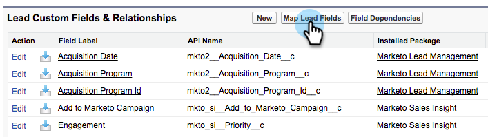

# Configurar o Marketo Sales Insight no Salesforce Enterprise/Unlimited {#configure-marketo-sales-insight-in-salesforce-enterprise-unlimited}

Configure o Marketo Sales Insight nas edições Salesforce Enterprise/Unlimited ao concluir as etapas a seguir.

>[!PREREQUISITES]
>
>[Instalar o pacote Marketo Sales Insight no Salesforce AppExchange](/help/marketo/product-docs/marketo-sales-insight/msi-for-salesforce/installation/install-marketo-sales-insight-package-in-salesforce-appexchange.md)

>[!NOTE]
>
>**São necessárias permissões de administrador.**

## Configurar o Sales Insight no Marketo Engage {#configure-sales-insight-in-marketo}

1. Para obter suas credenciais do Marketo Sales Insight no Marketo Engage, acesse o **[!UICONTROL Admin]** e selecione **[!UICONTROL Sales Insight]**.

   

1. Clique em **[!UICONTROL Editar configuração da API]**.

   

1. Insira uma chave secreta de API de sua escolha e clique em **[!UICONTROL Salvar]**. NÃO use um E comercial (`&`) na sua chave secreta de API.

   

   >[!NOTE]
   >
   >Sua chave secreta de API é como uma senha para sua organização e deve ser segura.

1. Para preencher as credenciais, clique em **[!UICONTROL Exibir]** no _[!UICONTROL Configuração da API Rest]_ painel.

   

1. Quando aparecer uma caixa de diálogo de confirmação, clique em **[!UICONTROL OK]**.

   

   >[!TIP]
   >
   >Mantenha essa janela aberta. Essas informações serão necessárias posteriormente para a configuração do Salesforce.

## Configurar o Sales Insight no Salesforce {#configure-sales-insight-in-salesforce}

1. No Salesforce, clique em **[!UICONTROL Configuração]**.

   

1. Procure por &quot;local remoto&quot; e selecione **[!UICONTROL Configurações do site remoto]**.

   

1. Clique em **[!UICONTROL Novo local remoto]**.

   

1. Insira o Nome do local remoto (pode ser algo semelhante a `MarketoSoapAPI`). Insira o URL do site remoto, que é o URL de host do Marketo na _[!UICONTROL Configuração da API Soap]_ painel no Marketo Engage. Clique em **[!UICONTROL Salvar]**. Agora você criou configurações de site remoto para a API Soap.

   

1. Clique em **[!UICONTROL Novo local remoto]** novamente.

   

1. Insira o Nome do local remoto (pode ser algo semelhante a `MarketoAPI`). Insira o URL do site remoto, que é o URL da API em _[!UICONTROL Configuração da API Rest]_ painel no Marketo Engage. Clique em **[!UICONTROL Salvar]**. Agora você criou configurações de site remoto para a API Rest.

   >[!NOTE]
   >
   >_Você_ escolha o seu **[!UICONTROL Nome do local remoto]** (`MarketoAPI` é usado aqui). A variável **[!UICONTROL URL do local remoto]** pode ser encontrado no campo Host do Marketo da caixa de diálogo Editar configuração da API da Etapa 3 na seção &quot;Configurar o Sales Insight no Marketo&quot;.

## Conceder aos usuários do Sales Insight acesso a objetos padrão do Salesforce {#grant-sales-insight-users-profile-access}

Devido aos aprimoramentos de segurança do Salesforce, os pacotes de AppExchanges não podem mais conceder permissão a objetos padrão, e o acesso deve ser concedido aos objetos relevantes do Salesforce a partir do perfil do usuário do Salesforce. Para conceder as permissões necessárias, siga estas etapas.

1. Clique em **[!UICONTROL Configuração]**.

1. Pesquise &quot;Perfis&quot; em Localização rápida.

1. Clique em **[!UICONTROL Editar]** ao lado do perfil que seus usuários do Salesforce estão usando.

1. No _[!UICONTROL Permissão de Objeto Padrão]_ seção, ativar **[!UICONTROL Ler]** acesso para os seguintes objetos: [!UICONTROL Lead], [!UICONTROL Contato], [!UICONTROL Conta], e [!UICONTROL Oportunidade].

1. Clique em **[!UICONTROL Salvar]**.

## Personalizar layouts de página {#customize-page-layouts}

1. Clique em **[!UICONTROL Configuração]**.

   

1. Procure por &quot;layout da página&quot; e selecione o **[!UICONTROL Layout da página]** em **[!UICONTROL Clientes potenciais]**.

   

1. Clique em **[!UICONTROL Visualforce Páginas]** à esquerda. Arrastar **[!UICONTROL Seção]** ao layout abaixo de _[!UICONTROL Links personalizados]_ seção.

   

1. Insira &quot;Marketo Sales Insight&quot; como o **[!UICONTROL Nome da seção]**, selecione **[!UICONTROL 1-coluna]** e clique em **[!UICONTROL OK]**.

   

1. Arrastar e soltar **[!UICONTROL Lead]** na nova seção.

   

   >[!TIP]
   >
   >O nome dessa caixa é alterado com base no tipo de objeto. Por exemplo, se você estiver modificando o layout de página para Contatos, ele exibirá Contato.

1. Clique duas vezes no ícone **[!UICONTROL Lead]** bloco que você acabou de adicionar.

   

1. Editar altura para **450** pixels e clique **[!UICONTROL OK]**.

   

   >[!NOTE]
   >
   >Marcar **[!UICONTROL Mostrar barras de rolagem]** se você precisar de acesso para rolar pelas atividades.

   >[!TIP]
   >
   >A altura recomendada para os objetos Contas e Oportunidades é de 410 pixels.

1. Clique em **[!UICONTROL Campos]** à esquerda. Em seguida, pesquise e arraste o **[!UICONTROL Urgente]** rótulo na caixa **[!UICONTROL Marketo Sales Insight]** layout.

   

1. Repita a etapa acima também para esses campos.

   * Último momento interessante
   * Data do último momento interessante
   * Desc. do último momento interessante
   * Fonte do último momento interessante
   * Tipo do último momento interessante
   * Última atividade por vendas
   * Último engajamento por vendas
   * ID de contato MSI
   * Pontuação relativa
   * Valor de pontuação relativa
   * Urgência
   * Valor de urgência
   * Exibir no Marketo

1. Clique em **[!UICONTROL Salvar]** quando terminar.

   

1. Repita as etapas de 5 a 7 para adicionar seções de página do Visualforce e campos do Sales Insight para **[!UICONTROL Contato]**, **[!UICONTROL Conta]**, e **[!UICONTROL Oportunidade]**.

1. Repita as etapas 8 a 10 para adicionar esses campos do Sales Insight para **[!UICONTROL Contato]**. Certifique-se de salvar as alterações.

   * Último momento interessante
   * Data do último momento interessante
   * [!UICONTROL Última Descrição de Momento Interessante]
   * [!UICONTROL Última origem de momento interessante]
   * [!UICONTROL Último tipo de momento interessante]
   * [!UICONTROL Última atividade do Marketo por vendas]
   * [!UICONTROL Último envolvimento da Marketo por vendas]
   * [!UICONTROL Pontuação de lead MKTO]
   * [!UICONTROL Pontuação relativa]
   * [!UICONTROL Valor da pontuação relativa]
   * [!UICONTROL Sales Insight] - Abre a página da lista completa de contatos
   * [!UICONTROL Urgente]
   * [!UICONTROL Valor de urgência]

## Mapear campos de pessoa personalizados {#map-custom-person-fields}

Os campos de pessoa do Marketo devem ser mapeados para campos de contato do Salesforce para garantir que a conversão funcione corretamente. Siga estas etapas para mapeá-las.

1. Clique em **[!UICONTROL Configuração]**.

   

1. Pesquise por &quot;campos&quot; na barra de pesquisa e clique em **[!UICONTROL Campos]** em **[!UICONTROL Clientes potenciais]**.

   

1. Clique em **[!UICONTROL Mapear campos de lead]**.

   

1. Clique na lista suspensa à direita de **[!UICONTROL Envolvimento]**.

   

1. Selecionar **[!UICONTROL Contact.Engagement]** na lista.

   

1. Repita e mapeie esses campos também.

   | Campo personalizado da pessoa do Marketo | Campo personalizado do contato do Salesforce |
   |--- |--- |
   | `Engagement` | `Contact.Engagement` |
   | `Relative Score Value` | `Contact.Relative Score Value` |
   | `Urgency Value` | `Contact.Urgency Value` |
   | `Last Interesting Moment Date` | `Contact.Last Interesting Moment Date` |
   | `Last Interesting Moment Desc` | `Contact.Last Interesting Moment Desc` |
   | `Last Interesting Moment Source` | `Contact.Last Interesting Moment Source` |
   | `Last Interesting Moment Type` | `Contact.Last Interesting Moment Type` |

1. Clique em **[!UICONTROL Salvar]** quando terminar.

## Guia de configuração do Marketo Sales Insight {#marketo-sales-insight-configuration-tab}

1. No Salesforce, clique na guia **+** no final da barra de guias e clique em **[!UICONTROL Configuração do Marketo Sales Insight]**.

1. Copie as credenciais do painel API Soap em [Página do administrador do Sales Insight da Marketo](/help/marketo/product-docs/marketo-sales-insight/msi-for-salesforce/configuration/configure-marketo-sales-insight-in-salesforce-professional-edition.md#set-up-marketo-sales-insight){target="_blank"} e cole-os na seção API SOAP da página Configuração do Salesforce Sales Insight.

1. Copie as credenciais do painel API REST em [Página do administrador do Sales Insight da Marketo](/help/marketo/product-docs/marketo-sales-insight/msi-for-salesforce/configuration/configure-marketo-sales-insight-in-salesforce-professional-edition.md#set-up-marketo-sales-insight){target="_blank"} e cole-os na seção API Rest da página Configuração do Salesforce Sales Insight.

   

Você poderá ver os campos Marketo Sales Insight para clientes potenciais, contatos, contas e oportunidades.

>[!NOTE]
>
>Se o teste de diagnóstico falhar, [adicionar mais campos ao layout da página](https://nation.marketo.com:443/t5/knowledgebase/how-to-repair-marketo-sales-insight-setup-configuration-problems/ta-p/248218){target="_blank"} O pode corrigir o problema.

>[!NOTE]
>
>Para contas do, o Sales Insight inclui todos os emails, mas somente os momentos interessantes mais recentes, a atividade da Web e as alterações de pontuação.

>[!MORELIKETHIS]
>
>* [Prioridade, Urgência, Pontuação Relativa e Melhores Opções](/help/marketo/product-docs/marketo-sales-insight/msi-for-salesforce/features/stars-and-flames/priority-urgency-relative-score-and-best-bets.md)
>* [Adicionar a guia Marketo ao Salesforce](/help/marketo/product-docs/marketo-sales-insight/msi-for-salesforce/configuration/add-marketo-tab-to-salesforce.md)
>* [Adicionar acesso ao Sales Insight aos perfis](/help/marketo/product-docs/marketo-sales-insight/msi-for-salesforce/configuration/add-sales-insight-access-to-profiles.md){target="_blank"}
