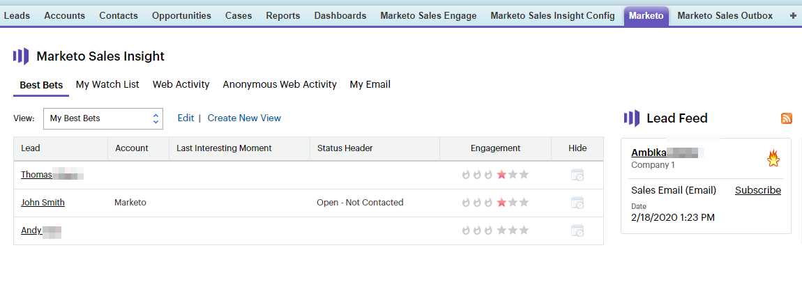

# Configurar o Marketo Sales Insight no Salesforce Enterprise/Unlimited {#configure-marketo-sales-insight-in-salesforce-enterprise-unlimited}

Estas são as etapas que você precisa seguir para configurar o Marketo Sales Insight nas Edições Enterprise/Unlimited do Salesforce. Vamos começar.

>[!PREREQUISITES]
>
>* [Instalar o pacote de informações de vendas da Marketo no Salesforce AppExchange](/help/marketo/product-docs/marketo-sales-insight/msi-for-salesforce/installation/install-marketo-sales-insight-package-in-salesforce-appexchange.md)

>[!NOTE]
**Permissões de administrador necessárias**

## Configurar o Sales Insight no Marketo {#configure-sales-insight-in-marketo}

1. Obtenha suas credenciais do MSI no Marketo. Vá para a área Admin e selecione **Sales Insight**.

   

1. Clique em **Editar configuração da API**.

   

1. Insira uma chave secreta da API de sua escolha e clique em **Save**. NÃO use um E comercial (&amp;) em sua Chave secreta da API.

   

   >[!NOTE]
   Sua chave secreta da API é como uma senha para sua organização e deve ser segura.

1. Clique em **Exibir** no painel Restante configuração da API para preencher as credenciais.

   

1. Você verá um pop-up de confirmação. Clique em **OK**.

   

   >[!TIP]
   Mantenha essa janela aberta. Você precisará dessas informações mais tarde no Salesforce.

## Configurar o Sales Insight no Salesforce {#configure-sales-insight-in-salesforce}

1. No Salesforce, clique em **Setup**.

   

1. Procure por &quot;site remoto&quot; e selecione **Configurações de site remoto**.

   

1. Clique em **Novo Site Remoto**.

   

1. Insira o Nome do site remoto (pode ser algo como &quot;MarketoSoapAPI&quot;). Insira o URL do site remoto, que é o URL do host do Marketo no painel Configuração da API Soap no Marketo. Clique em **Salvar**. Agora você criou configurações do site remoto para a API Soap.

   

1. Clique em **Novo Site Remoto** novamente.

   

1. Insira o Nome do site remoto (pode ser algo como &quot;MarketoAPI&quot;). Insira o URL do site remoto, que é o URL da sua API do painel Configuração da API restante no Marketo. Clique em **Salvar**. Agora você criou configurações de site remoto para a API Rest.

   >[!NOTE]
   __ Escolha o Nome do site  **remoto**  (a API do Marketo é usada aqui). O **URL do site remoto** pode ser encontrado no campo Host do Marketo da caixa de diálogo Editar configuração da API na Etapa 3 da seção &quot;Configurar insight de vendas no Marketo&quot;.

## Personalizar layouts de página {#customize-page-layouts}

1. Clique em **Configurar**.

   

1. Procure por &quot;layout de página&quot; e selecione o **Layout de página** em **Leads**.

   

1. Clique em **Visualforce Pages** à esquerda. Arraste **Section** para o layout abaixo da seção Links personalizados .

   

1. Insira &quot;Marketo Sales Insight&quot; como o **Nome da Seção**. Selecione **1-Column** e clique em **OK**.

   

1. Arraste e solte **Lead** na nova seção.

   

   >[!TIP]
   O nome dessa caixa será alterado com base no tipo de objeto. Por exemplo, se você estiver modificando o layout da página para Contatos, isso dirá Contato.

1. Clique duas vezes no bloco **Lead** que acabou de adicionar.

   

1. Edite a altura para **450** pixels e clique em **OK**.

   

   >[!TIP]
   Recomendamos uma altura de 410 pixels para os objetos Contas e Oportunidades.

1. Clique em **Fields** à esquerda. Em seguida, pesquise e arraste o rótulo **Engagement** para o layout **Marketo Sales Insight**.

   

1. Repita a etapa acima também para esses campos.

   <table> 
    <tbody> 
     <tr> 
      <td colspan="1">Envolvimento</td> 
     </tr> 
     <tr> 
      <td colspan="1" rowspan="1">
Valor de pontuação relativa
</td> 
     </tr> 
     <tr> 
      <td colspan="1" rowspan="1">
Valor de urgência
</td> 
     </tr> 
     <tr> 
      <td colspan="1" rowspan="1">
Data do último momento interessante
</td> 
     </tr> 
     <tr> 
      <td colspan="1" rowspan="1">
Desc. do último momento interessante
</td> 
     </tr> 
     <tr> 
      <td colspan="1" rowspan="1">
Fonte do último momento interessante
</td> 
     </tr> 
     <tr> 
      <td colspan="1" rowspan="1">
Tipo do último momento interessante
</td> 
     </tr> 
    </tbody> 
   </table>

1. Clique em **Salvar** quando terminar.

   

1. Repita esse processo para adicionar seções de página da Força de Vencimento e campos de Insight de Vendas para **Contato**, **Conta** e **Oportunidade**.

1. Repita as etapas 5 a 7 para adicionar seções de página de Força de Vencimento para Contato, Conta e Oportunidade. Em seguida, repita as etapas de 8 a 10 para adicionar campos de Informações de Vendas para **Contato**. Certifique-se de salvar após qualquer alteração.

## Mapear campos de pessoa personalizados {#map-custom-person-fields}

Os campos de pessoa do Marketo precisam ser mapeados para campos de contato do Salesforce para garantir que a conversão funcione corretamente. Veja como.

1. Clique em **Configurar**.

   

1. Procure por &quot;campos&quot; na barra de pesquisa e clique em **Fields** em **Leads**.

   

1. Clique em **Mapear campos de lead**.

   

1. Clique na lista suspensa à direita para **Engagement**.

   

1. Selecione **Contact.Engagement** na lista.

   

1. Repita e mapeie esses campos também.

   <table> 
    <tbody> 
     <tr> 
      <th colspan="1" rowspan="1">Campo personalizado de pessoa do Marketo</th> 
      <th colspan="1" rowspan="1">Campo Personalizado do Contato do Salesforce</th> 
     </tr> 
     <tr> 
      <td colspan="1" rowspan="1">
Envolvimento
</td> 
      <td colspan="1" rowspan="1">
Contact.Engagement
</td> 
     </tr> 
     <tr> 
      <td colspan="1" rowspan="1">
Valor de pontuação relativa
</td> 
      <td colspan="1" rowspan="1">
Valor da Pontuação Relativa ao Contact.Relative
</td> 
     </tr> 
     <tr> 
      <td colspan="1" rowspan="1">
Valor de urgência
</td> 
      <td colspan="1" rowspan="1">
Valor de Contact.Urgency
</td> 
     </tr> 
     <tr> 
      <td colspan="1" rowspan="1">
Data do último momento interessante
</td> 
      <td colspan="1" rowspan="1">
Data do Último Momento Interessante
</td> 
     </tr> 
     <tr> 
      <td colspan="1" rowspan="1">
Desc. do último momento interessante
</td> 
      <td colspan="1" rowspan="1">
Contact.Last Interesting Momento Desc
</td> 
     </tr> 
     <tr> 
      <td colspan="1" rowspan="1">
Fonte do último momento interessante
</td> 
      <td colspan="1" rowspan="1">
Contact.Last Interesting Moment Source
</td> 
     </tr> 
     <tr> 
      <td colspan="1" rowspan="1">
Tipo do último momento interessante
</td> 
      <td colspan="1" rowspan="1">
Tipo de Momento de Contato.Último Interessante
</td> 
     </tr> 
    </tbody> 
   </table>

1. Clique em **Salvar** quando terminar.

## Config. do Marketo Sales Insight {#marketo-sales-insight-config}

1. Clique em **+** e selecione **Marketo Sales Insight Config**.

   

1. Marque **Ativar a API do Marketo**. Em seguida, preencha as [Informações de configuração da API no Marketo Admin](#set-up-marketo-sales-insight). Clique em **Salvar alterações** quando terminar.

   

   >[!NOTE]
   Se o teste de diagnósticos falhar, talvez seja necessário [adicionar mais campos ao layout da página](https://nation.marketo.com/docs/DOC-1115).

E é isso! Você deve conseguir ver os campos Marketo Sales Insight para Clientes potenciais, Contatos, Contas e Oportunidades.

>[!NOTE]
Para contas, o Sales Insight incluirá todos os emails, mas somente os momentos interessantes mais recentes, a atividade da Web e as alterações de pontuação.

## Acessar Marketo Sales Insight {#access-marketo-sales-insight}

1. No Salesforce, clique em **+** no final da barra de guias e clique em **Marketo Sales Insight Config**.

1. Marque a caixa de seleção **Ativar API do Marketo** .

1. Copie as credenciais do painel da API Soap na página de administração do Insight de vendas da Marketo e cole-as na seção API Soap da página Configuração do Insight de vendas do Salesforce .

1. Copie as credenciais do painel da Rest API na página do Administrador do Insight de vendas da Marketo e cole-as na seção Rest API da página Configuração do Insight de vendas do Salesforce .

   

>[!MORELIKETHIS]
* [Prioridade, urgência, pontuação relativa e melhores propostas](/help/marketo/product-docs/marketo-sales-insight/msi-for-salesforce/features/stars-and-flames/priority-urgency-relative-score-and-best-bets.md)
* [Adicionar a guia e os botões do Marketo Sales Insight ao Salesforce](/help/marketo/product-docs/marketo-sales-insight/msi-for-salesforce/features/bulk-actions/add-marketo-sales-insight-tab-and-buttons-to-salesforce.md)
* [Configuração do insight de vendas para sua equipe](/help/marketo/product-docs/marketo-sales-insight/msi-for-salesforce/configuration/setting-up-sales-insight-for-your-team.md)

