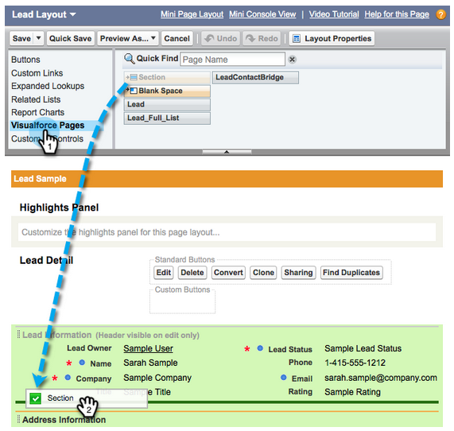

# Configurar o Marketo Sales Insight no Salesforce Professional Edition {#configure-marketo-sales-insight-in-salesforce-professional-edition}

Estas são as etapas necessárias para configurar o Marketo Sales Insight no Salesforce Professional Edition. Vamos começar.

>[!PREREQUISITES]
>
>* Instale o Marketo no Salesforce Professional Edition.
>
>* [Instalar o pacote de informações de vendas da Marketo no Salesforce AppExchange](/help/marketo/product-docs/marketo-sales-insight/msi-for-salesforce/installation/install-marketo-sales-insight-package-in-salesforce-appexchange.md)

>[!NOTE]
>
>**Permissões de administrador necessárias**

## Configurar o Sales Insight no Marketo {#configure-sales-insight-in-marketo}

1. Abra uma nova janela do navegador para obter as credenciais do Marketo Sales Insight de sua conta do Marketo.
1. Acesse a área Admin e selecione **Insight de vendas**.

   

1. Clique em **Editar configuração da API**.

   

1. Insira uma chave secreta de API de sua escolha e clique em **Salvar**. NÃO use um E comercial (&amp;) em sua Chave secreta da API.

   

   >[!NOTE]
   >
   >Sua chave secreta da API é como uma senha para sua organização e deve ser segura.

1. Clique em **Exibir** no painel Configuração da Rest API para preencher as credenciais.

   

1. Você verá um pop-up de confirmação. Clique em **OK**.

   

## Configurar o Sales Insight no Salesforce {#configure-sales-insight-in-salesforce}

1. No Salesforce, clique em **Configuração**.

   

1. Procure por &quot;site remoto&quot; e selecione **Configurações de local remoto**.

   

1. Clique em **Novo local remoto**.

   

1. Insira o Nome do site remoto (pode ser algo como &quot;MarketoSoapAPI&quot;). Insira o URL do site remoto, que é o URL do host do Marketo no painel Configuração da API Soap no Marketo. Clique em **Salvar**. Agora você criou configurações do site remoto para a API Soap.

   

1. Clique em **Novo local remoto** novamente.

   

1. Insira o Nome do site remoto (pode ser algo como &quot;MarketoRestAPI&quot;). Insira o URL do site remoto, que é o URL da sua API do painel Configuração da API restante no Marketo. Clique em **Salvar**. Agora você criou configurações de site remoto para a API Rest.

## Configurar o Marketo Sales Insight {#set-up-marketo-sales-insight}

1. Faça logon na instância do Marketo e clique em **Administrador**.

   

1. Clique em **Insight de vendas**.

   

1. Clique em **Editar configuração da API**.

   

1. Insira um **Chave secreta da API** e clique em **Salvar**.

   >[!CAUTION]
   >
   >Não use um E comercial (&amp;) em sua Chave secreta da API.

   

   >[!TIP]
   >
   >Mantenha essa janela aberta. Você precisará dessas informações posteriormente no Salesforce.

1. Volte para o Salesforce e clique em **Configuração**.

   

1. Procure por &quot;site remoto&quot; e clique em **Configuração de local remoto** under **Controles de segurança**.

   

1. Clique em **Novo local remoto**.

   

1. Enter **Nome do local remoto** e **URL de local remoto**, depois clique em **Salvar**.

   

   >[!NOTE]
   >
   >Você escolhe o seu **Nome do local remoto** (A API do Marketo é usada aqui). O **URL de local remoto** O pode ser encontrado no campo Host do Marketo da caixa de diálogo Editar configuração da API da etapa 4.

## Personalizar layouts de página {#customize-page-layouts}

1. Clique em **Configuração**.

   

1. Procure por &quot;layout de página&quot; e selecione o **Layout da página** under **Clientes potenciais**.

   

1. Clique em **Páginas da força de visita** à esquerda. Arrastar **Seção** para o layout na seção Links personalizados .

   

1. Digite &quot;Marketo Sales Insight&quot; como o **Nome da seção**. Selecionar **1-Coluna** e clique em **OK**.

   

1. Arrastar e soltar **Líder** na nova seção.

   

   >[!TIP]
   >
   >O nome dessa caixa será alterado com base no tipo de objeto. Por exemplo, se você estiver modificando o layout da página para Contatos, isso dirá Contato.

1. Clique duas vezes no **Líder** bloco que acabou de adicionar.

   

1. Editar altura para **450** pixels e clique **OK**.

   

   >[!NOTE]
   >
   >Verificar **Mostrar barras de rolagem** se você precisar acessar atividades de rolagem.

   >[!TIP]
   >
   >Recomendamos uma altura de 410 pixels para os objetos Contas e Oportunidades.

1. Clique em **Campos** à esquerda. Em seguida, pesquise e arraste a **Envolvimento** no **Insight sobre vendas da Marketo** layout.

   

1. Repita a etapa acima também para esses campos.

<table> 
 <tbody> 
  <tr> 
   <td colspan="1">Envolvimento</td> 
  </tr> 
  <tr> 
   <td colspan="1" rowspan="1">
Valor de pontuação relativa
</td> 
  </tr> 
  <tr> 
   <td colspan="1" rowspan="1">
Valor de urgência
</td> 
  </tr> 
  <tr> 
   <td colspan="1" rowspan="1">
Data do último momento interessante
</td> 
  </tr> 
  <tr> 
   <td colspan="1" rowspan="1">
Desc. do último momento interessante
</td> 
  </tr> 
  <tr> 
   <td colspan="1" rowspan="1">
Fonte do último momento interessante
</td> 
  </tr> 
  <tr> 
   <td colspan="1" rowspan="1">
Tipo do último momento interessante
</td> 
  </tr> 
 </tbody> 
</table>

1. lamber **Salvar** quando terminar.

   

1. Repita esse processo para adicionar seções de página de Força de Visita e campos de Insight de Vendas para **Contato**, **Conta** e **Oportunidade**.
1. Repita as etapas 5 a 7 para adicionar seções de página de Força de Vencimento para Contato, Conta e Oportunidade. Em seguida, repita as etapas de 8 a 10 para adicionar campos de Insight de vendas para **Contato**. Certifique-se de salvar após qualquer alteração.

## Mapear campos de pessoa personalizados {#map-custom-person-fields}

Os campos de pessoa do Marketo precisam ser mapeados para campos de contato do Salesforce para garantir que a conversão funcione corretamente. Veja como.

1. Clique em **Configuração**.

   

1. Procure por &quot;campos&quot; na barra de pesquisa e clique em **Campos** under **Clientes potenciais**.

   

1. Clique em **Mapear campos de lead**.

   

1. Clique na lista suspensa à direita para **Envolvimento**.

   

1. Selecionar **Contact.Engagement** na lista.

   

1. Repita e mapeie esses campos também.

<table> 
 <tbody> 
  <tr> 
   <th colspan="1" rowspan="1">Campo personalizado de pessoa do Marketo</th> 
   <th colspan="1" rowspan="1">Campo Personalizado do Contato do Salesforce</th> 
  </tr> 
  <tr> 
   <td colspan="1" rowspan="1">
Envolvimento
</td> 
   <td colspan="1" rowspan="1">
Contact.Engagement
</td> 
  </tr> 
  <tr> 
   <td colspan="1" rowspan="1">
Valor de pontuação relativa
</td> 
   <td colspan="1" rowspan="1">
Valor da Pontuação Relativa ao Contact.Relative
</td> 
  </tr> 
  <tr> 
   <td colspan="1" rowspan="1">
Valor de urgência
</td> 
   <td colspan="1" rowspan="1">
Valor de Contact.Urgency
</td> 
  </tr> 
  <tr> 
   <td colspan="1" rowspan="1">
Data do último momento interessante
</td> 
   <td colspan="1" rowspan="1">
Data do Último Momento Interessante
</td> 
  </tr> 
  <tr> 
   <td colspan="1" rowspan="1">
Desc. do último momento interessante
</td> 
   <td colspan="1" rowspan="1">
Contact.Last Interesting Momento Desc
</td> 
  </tr> 
  <tr> 
   <td colspan="1" rowspan="1">
Fonte do último momento interessante
</td> 
   <td colspan="1" rowspan="1">
Contact.Last Interesting Moment Source
</td> 
  </tr> 
  <tr> 
   <td colspan="1" rowspan="1">
Tipo do último momento interessante
</td> 
   <td colspan="1" rowspan="1">
Tipo de Momento de Contato.Último Interessante
</td> 
  </tr> 
 </tbody> 
</table>

1. Clique em **Salvar** quando terminar.

   

## Config. do Marketo Sales Insight {#marketo-sales-insight-config}

1. Clique em **+** e depois selecione **Configuração do Marketo Sales Insight**.

   

1. Verificar **Habilitar a API do Marketo**. Em seguida, preencha o [Informações de configuração da API no Marketo Admin](#set-up-marketo-sales-insight). Clique em **Salvar alterações** quando terminar.

   

   >[!NOTE]
   >
   >Se o teste de diagnóstico falhar, talvez seja necessário [adicionar mais campos ao layout da página](https://nation.marketo.com/docs/DOC-1115).

E é isso! Você deve conseguir ver os campos Marketo Sales Insight para Clientes potenciais, Contatos, Contas e Oportunidades.

>[!NOTE]
>
>Para contas, o Sales Insight incluirá todos os emails, mas somente os momentos interessantes mais recentes, a atividade da Web e as alterações de pontuação.

## Acessar Marketo Sales Insight {#access-marketo-sales-insight}

1. No Salesforce, clique no botão **+** no final da barra de guias e clique em **Configuração do Marketo Sales Insight**.

1. Selecione o **Habilitar a API do Marketo** caixa de seleção.

1. Copie as credenciais do painel da API Soap na página de administração do Insight de vendas da Marketo e cole-as na seção API Soap da página Configuração do Insight de vendas do Salesforce .

1. Copie as credenciais do painel da Rest API na página do Administrador do Insight de vendas da Marketo e cole-as na seção Rest API da página Configuração do Insight de vendas do Salesforce .

   

>[!MORELIKETHIS]
>
>* [Prioridade, urgência, pontuação relativa e melhores propostas](/help/marketo/product-docs/marketo-sales-insight/msi-for-salesforce/features/stars-and-flames/priority-urgency-relative-score-and-best-bets.md)
>* [Adicionar a guia Marketo ao Salesforce](/help/marketo/product-docs/marketo-sales-insight/msi-for-salesforce/configuration/add-marketo-tab-to-salesforce.md)
>* [Adicionar acesso ao insight de vendas a perfis](/help/marketo/product-docs/marketo-sales-insight/msi-for-salesforce/configuration/add-sales-insight-access-to-profiles.md){target=&quot;_blank&quot;}

