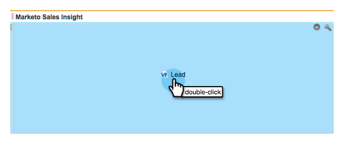

# Configurar o [!DNL Marketo Sales Insight] no [!DNL Salesforce] Professional Edition {#configure-marketo-sales-insight-in-salesforce-professional-edition}

Configure o Marketo Sales Insight no Salesforce Professional Edition seguindo as etapas abaixo.

>[!PREREQUISITES]
>
>* Instale o Marketo em sua [!DNL Salesforce] Professional Edition.
>
>* [Instalar [!DNL Marketo Sales Insight] Pacote no [!DNL Salesforce] AppExchange](/help/marketo/product-docs/marketo-sales-insight/msi-for-salesforce/installation/install-marketo-sales-insight-package-in-salesforce-appexchange.md){target="_blank"}

>[!NOTE]
>
>**Permissões de administrador são necessárias.**

## Configurar o Sales Insight no Marketo Engage {#configure-sales-insight-in-marketo}

1. Para obter as credenciais do Marketo Sales Insight da sua conta Marketo, abra uma nova janela do navegador.

1. Vá para a área **[!UICONTROL Administrador]** e selecione **[!UICONTROL Sales Insight]**.

   

1. Clique em **[!UICONTROL Editar Configuração de API]**.

   

1. Insira uma chave secreta de API de sua escolha e clique em **[!UICONTROL Salvar]**. NÃO use um E comercial (`&`) na chave secreta da API.

   

   >[!NOTE]
   >
   >Sua chave secreta de API é como uma senha para sua organização e deve ser segura.

1. Para preencher as credenciais, clique em **[!UICONTROL Exibir]** no painel _[!UICONTROL Configuração da API Rest]_.

   

1. Quando você vir uma caixa de diálogo de confirmação, clique em **[!UICONTROL OK]**.

   

## Configurar o Sales Insight em [!DNL Salesforce] {#configure-sales-insight-in-salesforce}

1. No Salesforce, clique em **[!UICONTROL Instalação]**.

   

1. Procure por &quot;site remoto&quot; e selecione **[!UICONTROL Configurações do Site Remoto]**.

   

1. Clique em **[!UICONTROL Novo Site Remoto]**.

   

1. Insira o Nome do Site Remoto (pode ser algo semelhante a `MarketoSoapAPI`). Insira o URL do site remoto, que é o URL do host do Marketo no painel Configuração da API Soap no Marketo Engage. Clique em **[!UICONTROL Salvar]**. Agora você criou configurações de site remoto para a API Soap.

   

1. Clique novamente em **[!UICONTROL Novo Site Remoto]**.

   

1. Insira o Nome do site remoto (pode ser algo como &quot;MarketoRestAPI&quot;). Insira o URL do site remoto, que é o URL da API no painel Configuração da API Rest no Marketo. Clique em **[!UICONTROL Salvar]**. Agora você criou configurações de site remoto para a API Rest.

## Conceder acesso ao perfil de usuários do Sales Insight a objetos padrão do Salesforce {#grant-sales-insight-users-profile-access}

Devido aos aprimoramentos de segurança do Salesforce, os pacotes do AppExchange não podem mais conceder permissão a objetos padrão e o acesso deve ser concedido aos objetos relevantes do Salesforce no perfil do usuário do Salesforce. Conceda as permissões necessárias seguindo estas etapas.

1. Clique em **[!UICONTROL Instalação]**.

1. Pesquise &quot;Perfis&quot; em Localização rápida.

1. Clique em **[!UICONTROL Editar]** ao lado do perfil que seus usuários do Salesforce estão usando.

1. Na seção Permissão de objeto padrão, habilite o acesso de leitura para os seguintes objetos: cliente em potencial, contato, conta e oportunidade.

1. Clique em **[!UICONTROL Salvar]**.

## Personalizar layouts de página {#customize-page-layouts}

1. Clique em **[!UICONTROL Instalação]**.

   

1. Procure por &quot;layout de página&quot; e selecione o **[!UICONTROL Layout de Página]** em **[!UICONTROL Clientes potenciais]**.

   

1. Clique em **[!UICONTROL Visualforce Pages]** à esquerda. Arraste **[!UICONTROL Seção]** para o layout abaixo da seção Links Personalizados.

   

1. Insira &quot;Marketo Sales Insight&quot; como o **[!UICONTROL Nome da seção]**. Selecione **[!UICONTROL 1-Coluna]** e clique em **[!UICONTROL OK]**.

   

1. Arraste e solte **[!UICONTROL Lead]** na nova seção.

   

   >[!TIP]
   >
   >O nome dessa caixa é alterado com base no tipo de objeto. Por exemplo, se você estiver modificando o layout de página para Contatos, ele exibirá Contato.

1. Clique duas vezes no bloco **[!UICONTROL Lead]** que você acabou de adicionar.

   

1. Edite a altura com 450 pixels e clique em **[!UICONTROL OK]**.

   

   >[!NOTE]
   >
   >Marque **[!UICONTROL Mostrar barras de rolagem]** se precisar de acesso para rolar pelas atividades.

   >[!TIP]
   >
   >A altura recomendada para os objetos Contas e Oportunidades é de 410 pixels.

1. Clique em **[!UICONTROL Campos]** à esquerda. Em seguida, pesquise e arraste o rótulo **[!UICONTROL Envolvimento]** para o layout **[!UICONTROL Marketo Sales Insight]**.

   

1. Repita a etapa anterior para os seguintes campos:

   * [!UICONTROL Engajamento]
   * [!UICONTROL Valor de Pontuação Relativo]
   * [!UICONTROL Valor de Urgência]
   * [!UICONTROL Data do Último Momento Interessante]
   * [!UICONTROL Última Descrição de Momento Interessante]
   * [!UICONTROL Último Source de Momento Interessante]
   * [!UICONTROL Último tipo de momento interessante]

1. Clique em **[!UICONTROL Salvar]** quando terminar.

   

1. Para adicionar seções de página do Visualforce para **[!UICONTROL Contato]**, **[!UICONTROL Conta]** e **[!UICONTROL Oportunidade]**, repita as etapas de 5 a 7.

1. Repita as etapas 8 a 10 para adicionar campos do Sales Insight para **[!UICONTROL Contato]**. Certifique-se de salvar após as alterações.

## Mapear campos de pessoa personalizados {#map-custom-person-fields}

Os campos de pessoa do Marketo devem ser mapeados para campos de contato do Salesforce para garantir que a conversão funcione corretamente. Siga estas etapas para mapeá-las.

1. Clique em **[!UICONTROL Instalação]**.

   

1. Pesquise por &quot;campos&quot; na barra de pesquisa e clique em **[!UICONTROL Campos]** em **[!UICONTROL Clientes potenciais]**.

   

1. Clique em **[!UICONTROL Mapear campos de cliente em potencial]**.

   

1. Clique na lista suspensa à direita de **[!UICONTROL Envolvimento]**.

   

1. Selecione **[!UICONTROL Contact.Engagement]** na lista.

   

1. Repita e mapeie esses campos também.

   | Campo personalizado da pessoa do Marketo | Campo personalizado do contato da Salesforce |
   |--- |--- |
   | `Engagement` | `Contact.Engagement` |
   | `Relative Score Value` | `Contact.Relative Score Value` |
   | `Urgency Value` | `Contact.Urgency Value` |
   | `Last Interesting Moment Date` | `Contact.Last Interesting Moment Date` |
   | `Last Interesting Moment Desc` | `Contact.Last Interesting Moment Desc` |
   | `Last Interesting Moment Source` | `Contact.Last Interesting Moment Source` |
   | `Last Interesting Moment Type` | `Contact.Last Interesting Moment Type` |

   {style="table-layout:auto"}

1. Quando terminar, clique em **[!UICONTROL Salvar]**.

   

## Guia de configuração do Marketo Sales Insight {#marketo-sales-insight-configuration-tab}

1. Na Salesforce, clique em **+** no final da barra de guias e clique em **[!UICONTROL Configuração do Marketo Sales Insight]**.

1. Copie as credenciais do painel API Soap na [página Administração de Insight de Vendas da Marketo](/help/marketo/product-docs/marketo-sales-insight/msi-for-salesforce/configuration/configure-marketo-sales-insight-in-salesforce-professional-edition.md#set-up-marketo-sales-insight){target="_blank"} e cole-as na seção API Soap da página Configuração de Insight de Vendas da Salesforce.

1. Copie as credenciais do painel **[!UICONTROL API Rest]** na [página Admin. do Marketo Sales Insight](/help/marketo/product-docs/marketo-sales-insight/msi-for-salesforce/configuration/configure-marketo-sales-insight-in-salesforce-professional-edition.md#set-up-marketo-sales-insight){target="_blank"} e cole-as na seção API Rest da página Configuração do Salesforce Sales Insight.

   

Você poderá ver os campos do Marketo Sales Insight para clientes potenciais, contatos, contas e oportunidades.

>[!NOTE]
>
>Se o teste de diagnóstico falhar, [adicionar mais campos ao layout de página](https://nation.marketo.com/t5/knowledgebase/how-to-repair-marketo-sales-insight-setup-configuration-problems/ta-p/248218){target="_blank"} poderá corrigir o problema.

>[!NOTE]
>
>Para contas do, o Sales Insight inclui todos os emails, mas somente os momentos interessantes mais recentes, a atividade da Web e as alterações de pontuação.

>[!MORELIKETHIS]
>
>* [Prioridade, Urgência, Pontuação Relativa e Melhores Opções](/help/marketo/product-docs/marketo-sales-insight/msi-for-salesforce/features/stars-and-flames/priority-urgency-relative-score-and-best-bets.md){target="_blank"}
>* [Adicionar a guia Marketo a [!DNL Salesforce]](/help/marketo/product-docs/marketo-sales-insight/msi-for-salesforce/configuration/add-marketo-tab-to-salesforce.md){target="_blank"}
>* [Adicionar Acesso do Sales Insight aos Perfis](/help/marketo/product-docs/marketo-sales-insight/msi-for-salesforce/configuration/add-sales-insight-access-to-profiles.md){target="_blank"}
