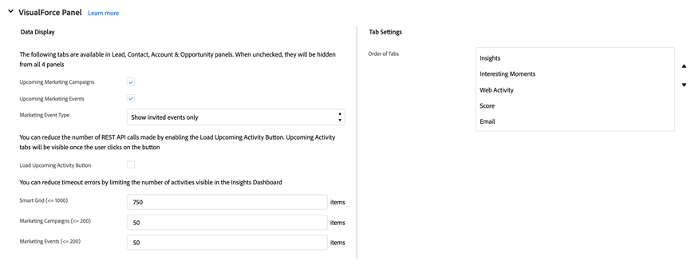

# Guia Configuração do Marketo Sales Insight no Salesforce {#marketo-sales-insight-configuration-tab-in-salesforce}

## Configurações Operacionais {#operational-settings}

Você precisará configurá-lo para começar a usar o Sales Insight no SFDC.

* O MSI usa API Soap e Rest
* A página Sales Insight na sua conta do Marketo terá dois painéis correspondentes com credenciais de API Soap e Rest que você pode copiar e colar aqui
* As APIs Soap e Rest têm tempos limite separados que podem ser definidos com base nas necessidades da organização. O tempo máximo permitido é de 120 segundos
* Desabilitar o painel de insights: você pode remover as credenciais da API Rest e usar somente a API Soap. Isso desativará a guia Painel de insights em todos os painéis de força visual do MSI

## Configuração MSI {#msi-configuration}

As configurações são aplicáveis a todos os usuários MSI e não são específicas de perfis.

**Configurações da página Visualforce**

* Habilitar menu suspenso de Ação:
   * Capacidade de ocultar o menu suspenso Enviar email do Marketo no lead e no layout MSI do contato
   * Capacidade de ocultar as opções Adicionar ao Marketo Campaign do menu suspenso no Layout MSI de cliente potencial e contato
* Eventos futuros: capacidade de mostrar eventos convidados, todos os eventos para usuários ou ocultar completamente esta guia
* Campanhas futuras: capacidade de mostrar todas as campanhas de email ou ocultar completamente essa guia
* Carregar campanhas e eventos futuros: capacidade de reduzir o número de chamadas à API Rest feitas pelos usuários, colocando a guia Eventos e campanhas atrás de um botão &quot;Carregar itens futuros&quot; sob demanda
* Configurações de guia: todas as cinco guias estarão disponíveis por padrão. Você pode escolher a ordem das guias no painel Sales Insight. A mesma ordem será aplicável a todos os layouts (cliente potencial, contato, conta, oportunidade)

**Guia Global do Marketo**

* Feed RSS ativado: quando ativado, os usuários do MSI podem visualizar seu feed RSS em um feed RSS (além do feed lead no Salesforce). O RSS feed só poderá funcionar se o recurso &quot;Expiração do token&quot; estiver desativado. Essa configuração é controlada na sua página de Administração do Marketo Sales Insight.
* Modo de depuração das melhores opções
* Ocultar padrão: a opção escolhida aqui será o número de dias que uma melhor opção ficará oculta na guia Melhores opções do Marketo ao clicar no ícone &quot;Ocultar&quot;
* Campo de status do contato: a opção escolhida aqui será o valor preenchido na coluna Cabeçalho do status na guia Melhores opções do Marketo
* Configurações do feed ao vivo: a opção permite exibir somente o feed ao vivo (nos painéis Cliente potencial, Contato, Conta e Oportunidade e na página Marketo global), somente o feed de cliente potencial (na página global da Marketo) ou os feeds ao vivo e de cliente potencial
* Configurações de guia: todas as cinco guias estarão disponíveis por padrão. Você pode escolher a ordem das guias na página global do Marketo

**Limites**

* A atividade (Momento interessante, Atividade da Web, Email) é definida como 1000 por padrão. Campanhas e eventos de email definidos como 200 por padrão
* Caso observe problemas de tempo limite na organização, é possível reduzir o limite

**Configurações de ação**

* Enviar email do Marketo: ativar essa opção fornecerá a todos os usuários do Sales Insight acesso para enviar emails dos painéis Cliente em potencial, Contato, Conta, Oportunidade e a guia Melhores Opções (ações em massa e envolvimento em linha)
* Adicionar ao Marketo Campaign: habilitar essa opção fornecerá a todos os usuários do Sales Insight acesso para adicionar campanhas dos painéis Lead, Contato, Conta, Oportunidade e a guia Melhores Opções (ações em massa e envolvimento em linha)

## Configurações de suporte {#support-settings}

Marcar essa caixa de seleção habilitará o Log de depuração na instância do Salesforce. Ele pode ajudá-lo a solucionar problemas.

## Redefinir Insight de vendas do Marketo {#reset-marketo-sales-insight}

Se você optar por fazer isso, todas as configurações no SFDC serão apagadas e não poderão ser restauradas. Será necessário reconfigurar tudo novamente.

>[!IMPORTANT]
>
>Não marque a caixa de seleção &quot;Ativar ações MSI&quot;, a menos que você esteja usando os recursos de Ações do Sales Insights.

>[!MORELIKETHIS]
>
>[Adicionar acesso ao Sales Insight aos perfis](/help/marketo/product-docs/marketo-sales-insight/msi-for-salesforce/configuration/add-sales-insight-access-to-profiles.md){target="_blank"}
