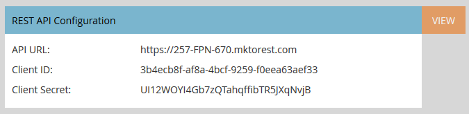

# Página de insights de vendas para administradores do Marketo {#sales-insight-page-for-marketo-admins}

Os administradores do Marketo têm determinados privilégios no Sales Insight. Saiba o que eles estão abaixo.

## Configuração da API Soap {#soap-api-configuration}

Essas credenciais são usadas para conectar sua conta do Salesforce à sua instância do Marketo, para usar o MSI no Salesforce.

## Configuração da API Rest {#rest-api-configuration}

Essas credenciais são usadas para conectar sua conta do Salesforce à sua instância do Marketo, a fim de usar o Painel de insights do MSI no Salesforce.

## Configurações de pontuação de pessoa {#person-score-settings}

* **Estrelas**: as estrelas representam a pontuação total do lead em comparação a outros leads.
* **Chamas**: as chamas representam a urgência - quanto a pontuação de um lead foi alterada recentemente.

Por padrão, o Marketo Sales Insight usa o campo Pontuação de lead para calcular estrelas e chamas. Mas se você quiser escolher um campo diferente, veja como:

1. Na área **Administrador** do Marketo, clique em **Sales Insight**.

   

1. Em Configurações de Pontuação de Cliente Potencial, clique em **Editar**.

   

1. Selecione o campo que deseja usar para estrelas.

   

1. Selecione o campo que deseja usar para as chamas.

   

1. Clique em **Salvar**. O Sales Insight levará algum tempo para ser recalculado. Você pode verificar seu CRM mais tarde para ver as estrelas e as chamas.

   

   >[!TIP]
   >
   >Se você ainda não tiver seus campos de pontuação personalizados, veja como [criá-los](/help/marketo/product-docs/administration/field-management/create-a-custom-field-in-marketo.md).

   >[!MORELIKETHIS]
   >
   >[Estrelas e chamas](/help/marketo/product-docs/marketo-sales-insight/msi-for-salesforce/features/stars-and-flames/customize-stars-and-flames.md)

## Configurações {#settings}

**Configurações de Cancelamento de Inscrição:**

Você pode escolher entre as seguintes configurações de cancelamento de inscrição para emails sem modelo, padrão e operacionais

* Respeitar Configuração De Cancelamento De Inscrição
* Respeitar as configurações de cancelamento de inscrição quando houver mais de 1 destinatário
* Respeitar as configurações de cancelamento de inscrição quando houver mais de 5 destinatários
* Ignorar configurações de cancelamento de inscrição

**Habilitar a capacidade de bloquear modelos:**

Quando ativados, os usuários MSI não poderão editar modelos ao enviar emails do Salesforce

**Habilitar RSS Feed:**

Quando ativado, os usuários do MSI podem visualizar seu feed de lead em um feed RSS (além do feed de lead no Salesforce). O RSS feed só poderá funcionar se o recurso &quot;Expiração do token&quot; estiver desativado.

**Expiração do token:**

A expiração do token é controlada no Gerenciador de recursos. Para habilitá-lo/desabilitá-lo, entre em contato com o [Suporte da Marketo](https://nation.marketo.com/t5/Support/ct-p/Support). Quando ativado, todos os tokens do Marketo expiram em 10 minutos. Quando desativados, os tokens do Marketo não expiram.

Os tokens gerados antes da ativação da Expiração do token não terão um tempo de expiração para validação, portanto, não expirarão mesmo se o recurso estiver ativado no momento.

Os tokens gerados após a ativação da Expiração do token terão um tempo de expiração de 10 minutos, portanto, eles ainda expirarão em 10 minutos, mesmo depois que o recurso for desativado.

O comportamento do token será baseado em quando ele foi gerado (quando o recurso de Expiração do token foi ativado/desativado, em vez do status atual do recurso).
