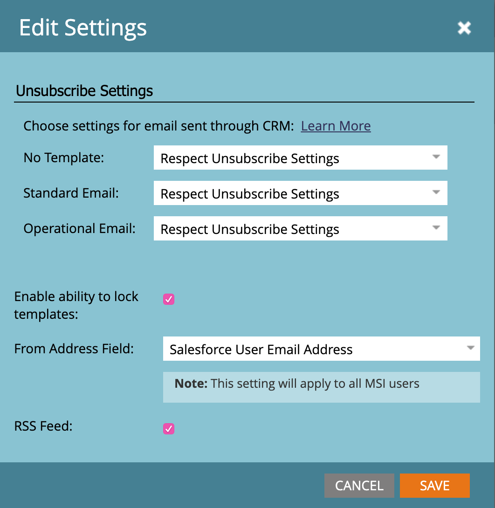

# Página [!DNL Sales Insight] para administradores do Marketo {#sales-insight-page-for-marketo-admins}

Administradores do Marketo têm determinados privilégios em [!DNL Sales Insight]. Saiba o que eles estão abaixo.

## Configuração da API Soap {#soap-api-configuration}

Essas credenciais são usadas para conectar sua conta do [!DNL Salesforce] à sua instância do Marketo, para usar o MSI no [!DNL Salesforce].

## Configuração da API Rest {#rest-api-configuration}

Essas credenciais são usadas para conectar sua conta do [!DNL Salesforce] à sua instância do Marketo, para usar o Painel de Insights do MSI no [!DNL Salesforce].

## Configurações de pontuação de pessoa {#person-score-settings}

* **[!UICONTROL Estrelas]**: as estrelas representam a pontuação total do lead em comparação a outros leads.
* **[!UICONTROL Chamas]**: as chamas representam a urgência - quanto a pontuação de um lead foi alterada recentemente.

Por padrão, [!DNL Marketo Sales Insight] usa o campo Pontuação de lead para calcular estrelas e chamas. Mas se você quiser escolher um campo diferente, veja como:

1. Na área **[!UICONTROL Admin]** do Marketo, clique em **[!UICONTROL Sales Insight]**.

   

1. Em [!UICONTROL Configurações de Pontuação de Cliente Potencial], clique em **[!UICONTROL Editar]**.

   

1. Selecione o campo que deseja usar para estrelas.

   

1. Selecione o campo que deseja usar para as chamas.

   

1. Clique em **[!UICONTROL Salvar]**. O Sales insight levará algum tempo para recalcular. Você pode verificar seu CRM mais tarde para ver as estrelas e as chamas.

   

   >[!TIP]
   >
   >Se você ainda não tiver seus campos de pontuação personalizados, veja como [criá-los](/help/marketo/product-docs/administration/field-management/create-a-custom-field-in-marketo.md).

   >[!MORELIKETHIS]
   >
   >[Estrelas e chamas](/help/marketo/product-docs/marketo-sales-insight/msi-for-salesforce/features/stars-and-flames/customize-stars-and-flames.md)

## Configurações {#settings}

**Configurações de Cancelamento de Inscrição:**

Você pode escolher entre as seguintes configurações de cancelamento de inscrição para [!UICONTROL Nenhum modelo], [!UICONTROL Emails padrão] e [!UICONTROL Emails operacionais]

* [!UICONTROL Respeitar Configuração de Cancelamento de Inscrição]
* [!UICONTROL Respeitar Configurações de Cancelamento de Inscrição quando houver mais de 1 destinatário]
* [!UICONTROL Respeitar Configurações de Cancelamento de Inscrição quando houver mais de 5 destinatários]
* [!UICONTROL Ignorar Configurações de Cancelamento de Inscrição]

**Habilitar a capacidade de bloquear modelos:**

Quando habilitados, os usuários MSI não poderão editar modelos ao enviar emails de [!DNL Salesforce]

**Habilitar RSS Feed:**

Quando habilitado, os usuários do MSI podem exibir seu Feed de cliente em potencial em um feed RSS (além do Feed de cliente em potencial em [!DNL Salesforce]). O RSS feed só poderá funcionar se o recurso &quot;[!UICONTROL Expiração do Token]&quot; estiver desabilitado.

**Expiração do token:**

A expiração do token é controlada no Gerenciador de recursos. Para habilitá-lo/desabilitá-lo, entre em contato com o [Suporte da Marketo](https://nation.marketo.com/t5/Support/ct-p/Support). Quando ativado, todos os tokens do Marketo expiram em 10 minutos. Quando desativados, os tokens do Marketo não expiram.

Os tokens gerados antes da ativação da Expiração do token não terão um tempo de expiração para validação, portanto, não expirarão mesmo se o recurso estiver ativado no momento.

Os tokens gerados após a ativação da Expiração do token terão um tempo de expiração de 10 minutos, portanto, eles ainda expirarão em 10 minutos, mesmo depois que o recurso for desativado.

O comportamento do token será baseado em quando ele foi gerado (quando o recurso de Expiração do token foi ativado/desativado, em vez do status atual do recurso).
