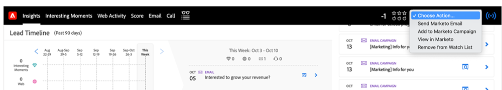
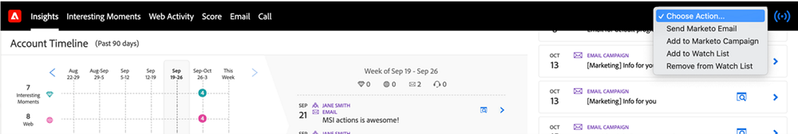
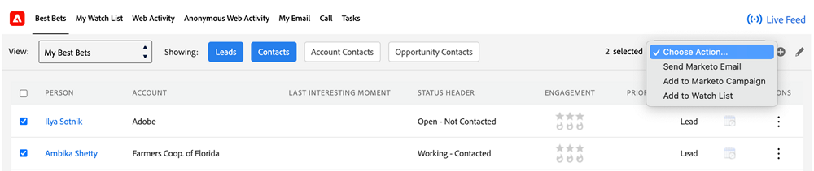

# Escolher uma Ação em [!DNL Sales Insight] {#choose-an-action-in-sales-insight}

As seguintes ações estão disponíveis no menu suspenso [!DNL Sales Insight] no [!DNL Salesforce] Classic e Lightning:

* Enviar e-mail do Marketo
* Adicionar à campanha do Marketo
* Adicionar à Lista de observação

Cada um desses recursos pode ser acessado de:

**Layout da página com uma única ação**

* Painel de layout de cliente potencial: Uma única ação e pode ser controlada pelo perfil do usuário
* Painel de layout de contato: Uma única ação e pode ser controlada pelo perfil do usuário
* Botão Layout do Lead: Uma única ação e não pode ser controlada pelo perfil do usuário
* Botão Layout do Contato: Uma única ação e não pode ser controlada pelo perfil do usuário

  

**Layout da página com ação de grupo**

* Painel de layout da conta: Ação de grupo e pode ser controlada pelo perfil do usuário
* Painel de layout de oportunidade: Ação de grupo e pode ser controlada pelo perfil do usuário

  

**[!DNL Best Bets]guia**

* Guia Ações em massa [!DNL Best Bets]: ação em grupo e pode ser controlada pelo perfil do usuário

  

* Guia Ações Embutidas [!DNL Best Bets]: Uma única ação e pode ser controlada pelo perfil do usuário

  

**Exibição de lista com ação em massa**

* Exibição da Lista de Clientes Potenciais: ação em massa e não pode ser controlada pelo perfil do usuário
* Exibição da Lista de Contatos: ação em massa e não pode ser controlada pelo perfil do usuário

  
