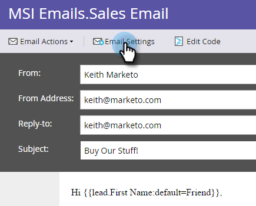
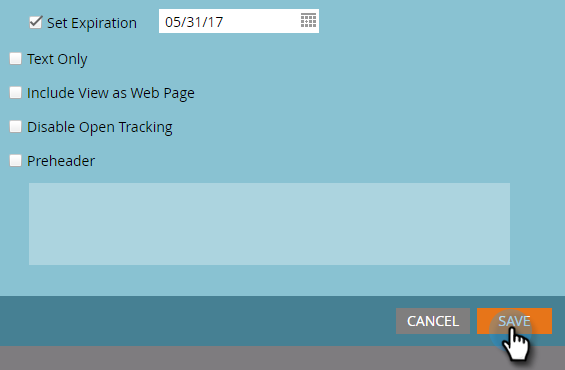

# Publicar um email em [!DNL Sales Insight] {#publish-an-email-to-sales-insight}

Habilite a configuração Publicar em [!DNL Sales Insight] para disponibilizar um email para sua equipe de vendas no [!DNL Sales Insight] e também no [!DNL Outlook] e no Suplemento Gmail. Você também pode fornecer uma data de expiração.

1. Encontre seu email, selecione-o e clique em **[!UICONTROL Editar Rascunho]**.

   

1. Assim que o editor for aberto, clique em **[!UICONTROL Configurações de email]**.

   

1. Marque **[!UICONTROL Publicar no Marketo Sales Insight]**.

   

1. Para definir uma data de expiração (opcional), marque **[!UICONTROL Definir expiração]** e escolha uma data.

   

   >[!NOTE]
   >
   >Às 23h00 (CST) da data de expiração (se você definir uma), o email que você disponibilizou desaparecerá de :59, bem como de qualquer um de seus suplementos. [!DNL Sales Insight] É claro que ele ainda estará acessível no Marketo.

1. Clique em **[!DNL Save]**.

   

Excelente! Agora você sabe como disponibilizar emails para a equipe de vendas enviar no lado do CRM e limitar o tempo disponível, se necessário.

>[!NOTE]
>
>[Meus Tokens](/help/marketo/product-docs/core-marketo-concepts/programs/tokens/understanding-my-tokens-in-a-program.md) não resolverá ao enviar um email de [!DNL Sales Insight] no [!DNL Microsoft Dynamics] ou [!DNL Salesforce]; somente os tokens padrão serão preenchidos (Cliente Potencial, Empresa, etc.). No entanto, os valores padrão para tokens funcionarão.

>[!TIP]
>
>Não se esqueça de aprovar este email para que as alterações entrem em vigor. Saiba como [Aprovar um Email](/help/marketo/product-docs/email-marketing/general/creating-an-email/approve-an-email.md).
