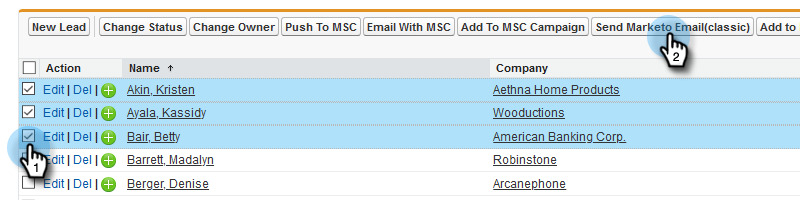

# Enviar um email para vários registros no Marketing Insight de vendas {#send-an-email-to-multiple-records-in-marketo-sales-insight}

É muito fácil enviar um email de marketing para várias pessoas usando o Marketing Insight de vendas. Vamos começar.

1. No Salesforce, clique em **Clientes potenciais** ou **Contatos**.

   

1. Clique em **Ir** para visualização de todos os clientes potenciais abertos.

   

1. Na visualização da lista, verifique todos os clientes potenciais/contatos para os quais deseja enviar e-mail e clique em **Enviar e-mail para o Marketing (clássico)**.

   

   >[!NOTE]
   >
   >Se você estiver usando o Salesforce Lightning, o botão exibirá **Send Marketo Email (lightning)**.

   >[!TIP]
   >
   >Não vê o botão? Verifique se você [adicionou os botões de marketing à visualização](add-marketo-sales-insight-tab-and-buttons-to-salesforce.md)da lista.

1. Vá em frente e componha seu e-mail. Clique em **Enviar com marketing **ao terminar.

   

   >[!TIP]
   >
   >Você pode [publicar emails no Sales Insight](../../../../../product-docs/marketo-sales-insight/msi-for-salesforce/features/actions-in-the-msi-panel/send-marketo-email/publish-an-email-to-sales-insight.md) e escolher um desses emails.

   >[!NOTE]
   >
   >Você pode enviar até 200 emails do Marketo de cada vez.

