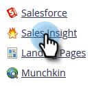
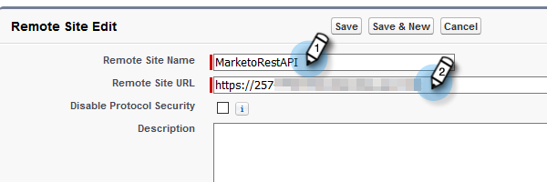

# Configuração para clientes existentes {#configuration-for-existing-customers}

Configure a seguinte configuração para começar a usar o novo Painel do Insights.

>[!NOTE]
>
>**Pré-requisitos**
>
>Certifique-se de que você atualizou seu pacote do Salesforce para a versão mais recente

## Configurar insight de vendas no Marketing {#configure-sales-insight-in-marketo}

1. Abra uma nova guia no navegador para obter as credenciais do Marketing Sales Insights de sua conta de Marketing.
1. Vá para a área **Admin** .

   

1. Clique em **Sales Insight**.

   

1. Clique em **Visualização** para preencher as credenciais da Rest API.

   

1. Você verá um pop-up de confirmação. Clique em **OK**.

## Configurar insight de vendas no Salesforce {#configure-sales-insight-in-salesforce}

1. No Salesforce, clique em **Configuração**.

   

1. Procure e selecione Configurações **de site** remoto.

   

1. Clique em **Novo site** remoto.

   

1. Digite o Nome do site remoto (pode ser algo como &quot;MarketoRestAPI&quot;) e o URL do site remoto (seu URL da API no painel Configuração da Rest API no Marketo).

   

1. Clique em **Salvar**.

   

   Agora você criou a configuração de site remoto para a Rest API.

## Acessar informações de vendas de marketing {#access-marketo-sales-insight}

1. Copie as credenciais do painel da Rest API na página Admin do Marketing Insight de vendas. Cole-os na seção Rest API na página Sales Insight Configuration do Salesforce.
1. Insira a chave secreta da API.

   

