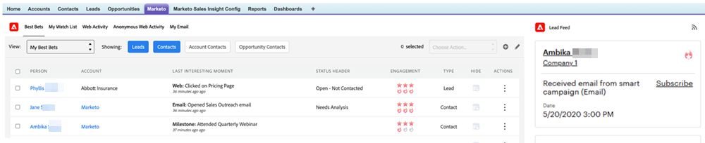
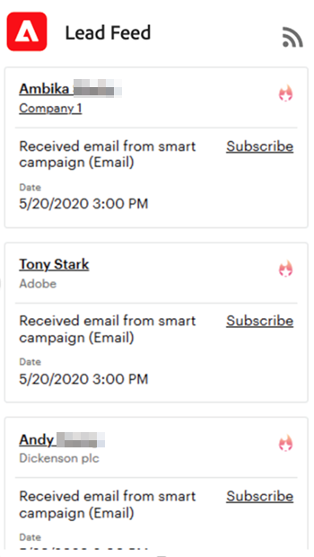

# Uso do feed de cliente em potencial {#using-the-lead-feed}

O Feed de lead é uma lista atualizada por minuto de eventos interessantes feitos por seus leads. Você o encontrará no lado direito ao clicar na guia Marketo. É como um RSS ou feed do [!DNL Twitter]. As atualizações mais recentes estão no topo da lista. Use isso para saltar em leads enquanto você ainda está fresco em suas mentes.

>[!NOTE]
>
>O feed de clientes potenciais inclui os clientes potenciais que você possui e os clientes potenciais na lista de observação.

## O que há no Feed principal? {#whats-in-the-lead-feed}

Cada item no feed do lead é um momento interessante - uma atividade ou evento notável no histórico de marketing deste lead.

Ao exibi-lo em [!DNL Salesforce], cada item tem:

<table> 
 <colgroup> 
  <col> 
  <col> 
 </colgroup> 
 <tbody> 
  <tr> 
   <td>
Item
</td> 
   <td>
Descrição
</td> 
  </tr> 
  <tr> 
   <td>
A. Cliente Potencial/Contato
</td> 
   <td>
Pessoa que teve este momento interessante
</td> 
  </tr> 
  <tr> 
   <td>
B. Tipo de evento
</td> 
   <td>
Categoria para este momento — Web, email ou marco
</td> 
  </tr> 
  <tr> 
   <td>
C. Nome da conta
</td> 
   <td>
Nome da empresa
</td> 
  </tr> 
  <tr> 
   <td>
D. Hora
</td> 
   <td>
Quando este interessante momento ocorreu
</td> 
  </tr> 
  <tr> 
   <td>
E. Descrição do evento
</td> 
   <td>
Motivo para este momento interessante
</td> 
  </tr> 
  <tr> 
   <td>
F. Assinar
</td> 
   <td>
Receber notificação por email para eventos como este
</td> 
  </tr> 
  <tr> 
   <td>
G. Star
</td> 
   <td>
Esta pessoa é uma Melhor Opção (alta prioridade)
</td> 
  </tr> 
 </tbody> 
</table>

## Obtendo atualizações de RSS {#getting-rss-updates}

Você também pode obter atualizações do Feed principal por RSS feed.  Um RSS feed permite que você receba atualizações sobre seus clientes potenciais, mesmo que não esteja conectado a [!DNL Salesforce]. O feed tem as mesmas informações que o feed de cliente potencial em [!DNL Salesforce] bem como as seguintes informações (quando disponíveis):

* endereço de e-mail
* telefone
* número do celular
* número de fax
* endereço da empresa
* URL da empresa

>[!NOTE]
>
>O administrador do Marketo da sua empresa deve [habilitar os RSS feeds](/help/marketo/product-docs/marketo-sales-insight/msi-for-salesforce/features/msi-configuration-tab/enable-rss-for-sales-insight.md) para que isso funcione.

Para obter atualizações de RSS, você precisará de duas coisas: o link RSS e um leitor de feed RSS. Você pode obter o link RSS clicando no ícone RSS no feed do lead:

O RSS feed será exibido em uma nova janela. Em seguida, você pode copiar o URL do feed RSS e usá-lo em um leitor de RSS. A maioria dos navegadores tem um leitor de RSS integrado ou você pode usar um leitor de RSS específico para sua plataforma.
