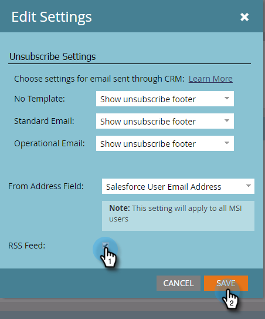

# Habilitar RSS para Insight de vendas {#enable-rss-for-sales-insight}

>[!NOTE]
>
>**Permissões de administrador necessárias**

Se os usuários do Marketo quiserem exibir seu feed principal não apenas no Salesforce, mas também em um feed RSS, um administrador do Marketo deverá habilitá-lo primeiro. É fácil.

1. Em Meu Marketo, clique em **Admin** e depois em **Sales Insight**.

   

1. Em Configurações, clique em **Editar**. Observe que o RSS Feed é exibido como **Desabilitado**.

   

1. Na caixa de diálogo Editar configurações, marque a caixa de seleção **RSS feed** e clique em **Salvar**.

   

   O RSS feed agora é exibido como **Habilitado**.

   

   Pedaço de bolo!
