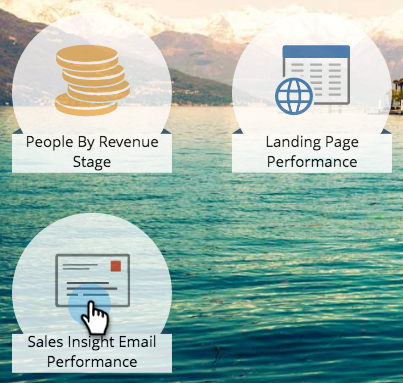

# Relatório de desempenho de emails do Insight de vendas {#sales-insight-email-performance-report}

Visualize o desempenho de emails enviados por meio do [!DNL Salesforce], [!DNL Microsoft Dynamics], ou de um plug-in do Gmail ou [!DNL Outlook].

## Gerar um relatório {#generate-a-report}

1. Clique em **[!UICONTROL Analytics]**.

   

1. Clique em **[!UICONTROL Sales Insight Email Performance]**.

   

1. Clique na guia **[!UICONTROL Configuração]** e escolha os valores desejados.

   

1. Clique na guia **[!UICONTROL Relatório]**.

   

   Ótimo! Agora você pode ver o desempenho de seus emails enviados pela equipe de vendas.

   >[!NOTE]
   >
   >O status de Entregue não é capturado para emails enviados pelo Sales Insight e não será incluído neste relatório ou logs de atividades.

>[!TIP]
>
>Clique no nome de um email para abri-lo no Pré-visualizador de email.

## Agrupar por [!UICONTROL Representante de Vendas] {#group-by-sales-rep}

Você pode exibir este relatório agrupado por Representante de vendas alterando suas configurações.

1. Clique em **[!UICONTROL Instalação]**. Clique duas vezes em **[!UICONTROL Email]**.

   

1. Selecione Agrupar emails de **[!UICONTROL Representante de vendas]**.

   

1. Clique em **[!UICONTROL Salvar]**.

   

1. Clique na guia **[!UICONTROL Relatório]**.

   

   Muito legal, não é? Agora é possível ver o desempenho dos emails agrupados por representante de vendas.
