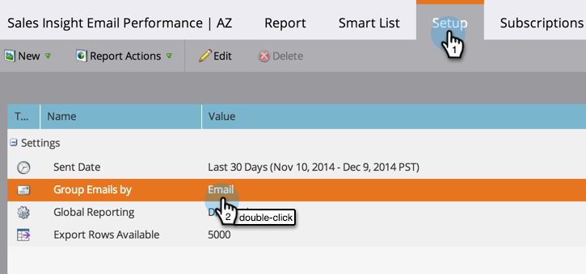

# Relatório de Desempenho de Email do Sales Insight {#sales-insight-email-performance-report}

Visualização do desempenho de emails enviados pelo Salesforce, Microsoft Dynamics ou por um plug-in do Gmail ou Outlook.

## Gerar um relatório {#generate-a-report}

1. Clique em **Analytics**.

   

1. Clique em Desempenho **de email do** Sales Insight.

   

1. Clique na guia **Configuração** e escolha os valores desejados.

   

1. Clique na guia **Relatório** .

   

   Ótimo! Agora você pode ver como seus e-mails enviados da sua equipe de vendas foram executados.

   >[!NOTE]
   >
   >O status entregue não é capturado para e-mails enviados via Sales Insight e não será incluído neste relatório ou logs de atividades.

>[!TIP]
>
>Clique no nome de um email para abri-lo no Visualizador de email.

## Agrupar por representante de vendas {#group-by-sales-rep}

É possível visualização esse relatório agrupado por representante de vendas alterando suas configurações.

1. Clique em **Configuração**. Duplo clique em **Email**.

   

1. Selecione Agrupar emails por representante **de vendas**.

   

1. Clique em **Salvar**.

   

1. Clique na guia **Relatório** .

   

   Muito legal, hein? Agora você pode ver o desempenho de emails agrupados por representante de vendas.

