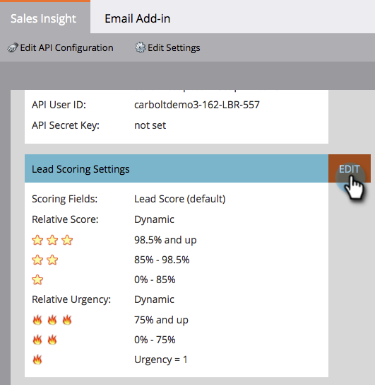

# Personalizar estrelas e chamas {#customize-stars-and-flames}

[!DNL Marketo Sales Insight] usa estrelas e chamas para priorizar leads. O Marketo decide automaticamente quem recebe 1-2-3 estrelas/chamas. No entanto, você pode modificar a fórmula. Veja como:

>[!AVAILABILITY]
>
>Nem todos os usuários do Marketo Engage compraram essa funcionalidade. Entre em contato com a equipe de conta da Adobe (seu gerente de conta) para obter mais detalhes.

>[!NOTE]
>
>**Permissões de administrador são necessárias**

1. Em [!UICONTROL Admin], clique em **[!UICONTROL Sales Insight]**.

1. Na seção **[!UICONTROL Configurações de Pontuação de Cliente Potencial]**, clique em **[!UICONTROL Editar]**.

   

1. Selecione o **[!UICONTROL Método de Pontuação]** de sua escolha.

   >[!NOTE]
   >
   >**Definição**
   >
   >**[!UICONTROL Dinâmico]** - É um valor percentual derivado de [dados relativos](/help/marketo/product-docs/marketo-sales-insight/msi-for-salesforce/features/stars-and-flames/priority-urgency-relative-score-and-best-bets.md). Coisas incríveis. Esse método é recomendado.
   >
   >**[!UICONTROL Estático]** - Permite definir números de pontuação exatos - sem mais porcentagens, sem mais molhos secretos.

   

1. Edite os colchetes de porcentagem de sua preferência e **[!UICONTROL Salve]**.

   >[!TIP]
   >
   >Basta editar a porcentagem inicial. O Marketo calculará a porcentagem final para você.

   

>[!NOTE]
>
>Depois que as mudanças forem feitas, o processo de recálculo de estrelas e chamas levará algum tempo. A paciência é uma virtude.

Querida! Você acabou de personalizar a maneira como a Marketo calcula estrelas e chamas para melhor atender às suas necessidades comerciais.
