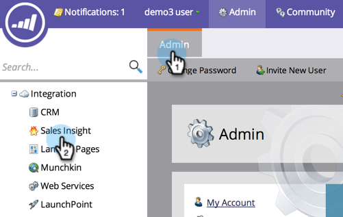

# Definir campos de pontuação a serem usados para [!UICONTROL Estrelas] e [!UICONTROL Chamas] em [!DNL Sales Insight] {#set-score-fields-to-be-used-for-stars-and-flames-in-sales-insight}

>[!NOTE]
>
>**Permissões de administrador necessárias**

Por padrão, [!DNL Marketo Sales Insight] usa o campo **[!UICONTROL Pontuação do lead]** para calcular estrelas e chamas. Mas se você quiser escolher um campo diferente, veja como:

>[!TIP]
>
>Se você ainda não tiver seus campos de pontuação personalizados, veja como [criá-los](/help/marketo/product-docs/administration/field-management/create-a-custom-field-in-marketo.md).

>[!NOTE]
>
>**Definição**
>
>* **[!UICONTROL Estrelas]**: as estrelas representam a pontuação total do lead em comparação com outros leads.
>* **[!UICONTROL Chamas]**: as chamas representam a urgência - quanto a pontuação de um lead mudou recentemente.
>

1. Em **[!UICONTROL Admin]**, clique em **[!UICONTROL Sales Insight]**.

   

1. Em **[!UICONTROL Configurações de Pontuação de Cliente Potencial]**, clique em **[!UICONTROL Editar]**.

   

1. Selecione o campo que deseja usar para **[!UICONTROL Estrelas]**.

   

1. Selecione o campo que deseja usar para **[!UICONTROL Chamas]**.

   

1. Clique em **[!UICONTROL Salvar]**.

   

   >[!NOTE]
   >
   >[!DNL Sales insight] levará algum tempo para recalcular. Você pode verificar seu CRM mais tarde para ver as estrelas e as chamas.

   >[!MORELIKETHIS]
   >
   >[Prioridade, Urgência, Pontuação Relativa e Melhores Opções](/help/marketo/product-docs/marketo-sales-insight/msi-for-salesforce/features/stars-and-flames/priority-urgency-relative-score-and-best-bets.md)
