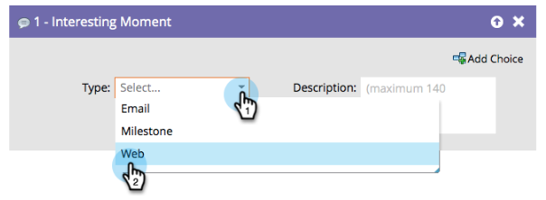

# Visão geral de momentos interessantes {#interesting-moments-overview}

Você pode usar a interessante etapa de fluxo de momento para dar à sua equipe de vendas visibilidade sobre as coisas interessantes que seus clientes em potencial estão fazendo em uma Campanha inteligente.

1. Selecione o tipo de momento interessante que deseja usar.

   

1. Defina o texto que deseja que sua equipe de vendas veja.

   

>[!TIP]
>
>**Menos é mais**. Trabalhe com sua equipe de vendas para garantir que momentos interessantes sejam realmente interessantes.

Você também pode usar tokens em momentos interessantes para fazer descrições dinâmicas realmente úteis.

>[!MORELIKETHIS]
>
>* [Usando Momentos Interessantes](/help/marketo/product-docs/marketo-sales-insight/msi-for-salesforce/features/tabs-in-the-msi-panel/interesting-moments/using-interesting-moments.md)
>* [Tokens para Momentos Interessantes](/help/marketo/product-docs/marketo-sales-insight/msi-for-salesforce/features/tabs-in-the-msi-panel/interesting-moments/trigger-tokens-for-interesting-moments.md)
