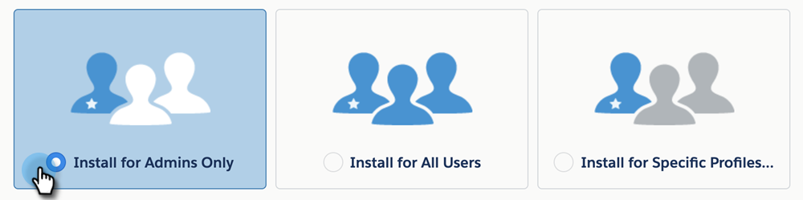

# Instalar o pacote de insight de vendas do Marketing Cloud na AppExchange do Salesforce {#install-marketo-sales-insight-package-in-salesforce-appexchange}

Você precisa instalar o aplicativo Marketing Insight de vendas na subscrição do Salesforce antes de poder desfrutar de todas as informações de vendas. Veja como.

>[!NOTE]
>
>**Permissões de administrador necessárias**

>[!NOTE]
>
>O Marketing to Sales Insight é compatível com a Criptografia da plataforma Salesforce (Shield).

1. Vá para a página de [AppExchange do Marketing](http://appexchange.salesforce.com/listingDetail?listingId=a0N30000001SVZmEAO) Sales Insight e clique em **Obter agora**.

   

1. Clique em **Fazer logon no botão AppExchange** e faça logon com suas credenciais do Salesforce.
1. Insira o logon da conta do Salesforce conectado e clique em **Instalar no Production**.

   

   >[!TIP]
   >
   >Se quiser testá-la primeiro na sua caixa de proteção, escolha **Instalar na caixa de proteção**.

1. Leia e aceite os termos e condições e clique em** Confirmar e Instalar**.

   

1. Você pode escolher &quot;Instalar somente para administradores&quot; (e fornecer acesso MSI a perfis específicos posteriormente), &quot;Instalar para todos os usuários&quot; ou &quot;Instalar para Perfis específicos&quot;.

   

1. Você poderá ver a seguinte mensagem ao start do processo de instalação. Você receberá um e-mail assim que a instalação for concluída. Clique em **Concluído** para rejeitar.

   

1. Verifique se** Marketing to Sales Insight** está nos pacotes instalados.

   

1. Clique em **Configuração** ao lado do seu nome.

   

1. Procure por &quot;objetos&quot; e clique em **Objetos** em **Criar**.

   

1. Verifique se a opção **Implantado** está marcada para todos os itens do Marketing to Sales Insight.

   

1. Se um objeto não estiver implantado, clique em **Editar **ao lado do item.

   

1. Na seção Status **de** implantação, selecione **Implantado** e clique em **Salvar**.

   

Ótimo trabalho! Agora você instalou e implantou o Marketing Insight de vendas. Vá em frente e configure-o para sua equipe de vendas e observe o lançamento das vendas.

>[!NOTE]
>
>**Artigos relacionados**
>
>[Configurar o Marketing Sales Insight no Salesforce Professional Edition](../../../../product-docs/marketo-sales-insight/msi-for-salesforce/configuration/configure-marketo-sales-insight-in-salesforce-professional-edition.md)
>
>[Configurar o Marketing to Sales Insight no Salesforce Enterprise/Unlimited](../../../../product-docs/marketo-sales-insight/msi-for-salesforce/configuration/configure-marketo-sales-insight-in-salesforce-enterprise-unlimited.md)

