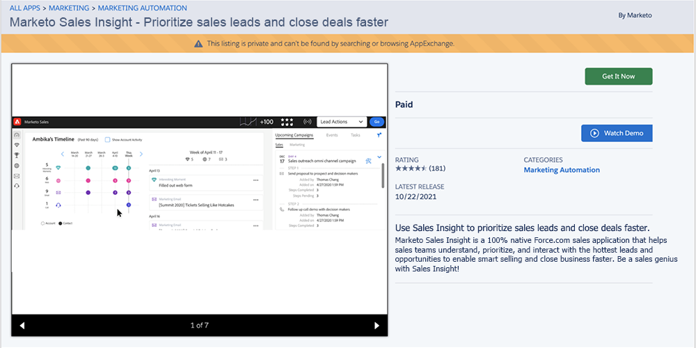

# Instalar o pacote Marketo Sales Insight no Salesforce AppExchange {#install-marketo-sales-insight-package-in-salesforce-appexchange}

Você precisa instalar o aplicativo Marketo Sales Insight em sua assinatura do Salesforce antes de poder aproveitar todos os benefícios que o Sales Insight oferece. Veja como.

>[!NOTE]
>
>**Permissões de administrador necessárias**

>[!NOTE]
>
>O Marketo Sales Insight é compatível com a criptografia da plataforma Salesforce (Shield).

1. Vá para a [página do AppExchange do Marketo Sales Insight](https://appexchange.salesforce.com/listingDetail?listingId=a0N30000001SVZmEAO) e clique em **Obter agora**.

   

1. Clique em **Fazer logon no botão AppExchange** e faça logon com suas credenciais do Salesforce.

1. Insira seu logon conectado na conta do Salesforce e clique em **Instalar na produção**.

   

   >[!TIP]
   >
   >Se quiser testá-la primeiro em sua sandbox, escolha **Instalar em Sandbox**.

1. Leia e aceite os termos e condições e clique em **Confirmar e instalar**.

   

1. Você pode optar por &quot;Instalar somente para administradores&quot; (e fornecer acesso MSI a perfis específicos posteriormente), &quot;Instalar para todos os usuários&quot; ou &quot;Instalar para perfis específicos&quot;.

   

1. Você poderá ver a seguinte mensagem assim que iniciar o processo de instalação. Você receberá um email quando a instalação for concluída. Clique em **Concluído** para descartar.

   

1. Verifique se o **Marketo Sales Insight** está nos pacotes instalados.

   

1. Clique em **Configurar** próximo ao seu nome.

   

1. Procure por &quot;objetos&quot; e clique em **Objetos** em **Criar**.

   

1. Verifique se **Implantado** está marcado para todos os itens do Marketo Sales Insight.

   

1. Se um objeto não for implantado, clique em **Editar** ao lado do item.

   

1. Na seção **Status de implantação**, selecione **Implantado** e clique em **Salvar**.

   

Excelente trabalho! Agora você instalou e implantou o Marketo Sales Insight. Vá em frente e configure-o para sua equipe de vendas e assista ao disparo de vendas.

>[!MORELIKETHIS]
>
>* [Configurar o Marketo Sales Insight no Salesforce Professional Edition](/help/marketo/product-docs/marketo-sales-insight/msi-for-salesforce/configuration/configure-marketo-sales-insight-in-salesforce-professional-edition.md)
>* [Configurar o Marketo Sales Insight no Salesforce Enterprise/Unlimited](/help/marketo/product-docs/marketo-sales-insight/msi-for-salesforce/configuration/configure-marketo-sales-insight-in-salesforce-enterprise-unlimited.md)
>* [Adicionar Acesso ao Sales Insight aos Perfis](/help/marketo/product-docs/marketo-sales-insight/msi-for-salesforce/configuration/add-sales-insight-access-to-profiles.md){target="_blank"}
