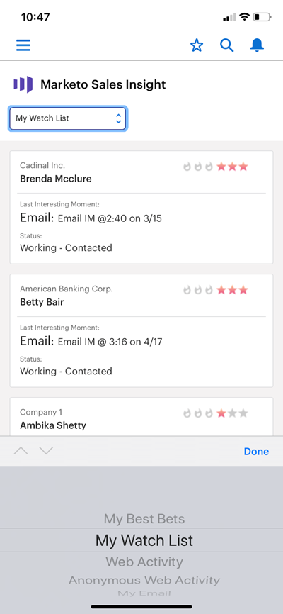

# [!DNL Best Bets] em [!DNL Salesforce1] {#best-bets-in-salesforce}

Seus [[!DNL Best Bets]](/help/marketo/product-docs/marketo-sales-insight/msi-for-salesforce/features/stars-and-flames/priority-urgency-relative-score-and-best-bets.md) são seus clientes em potencial e contatos com a maior urgência e pontuação relativa. Somente os clientes em potencial que você possui estão visíveis nessa lista, e ela é atualizada conforme as pontuações dos clientes em potencial mudam.

1. Vá para a área do Marketo no aplicativo [!DNL Salesforce].

   Na lista suspensa, você pode escolher &quot;[!UICONTROL Minhas Melhores Opções]&quot;, &quot;[!UICONTROL Minha Lista de Controle]&quot;, &quot;[!UICONTROL Atividade da Web]&quot;, &quot;[!UICONTROL Atividade Anônima da Web]&quot; ou &quot;[!UICONTROL Meu Email].&quot;

   

>[!MORELIKETHIS]
>
>* [Momentos Interessantes no [!UICONTROL Salesforce1]](/help/marketo/product-docs/marketo-sales-insight/msi-for-salesforce/msi-for-mobile/interesting-moments-in-salesforce1.md)
>* [Enviar emails do Marketo e ações do Campaign e da Lista de favoritos na [!UICONTROL Salesforce1]](/help/marketo/product-docs/marketo-sales-insight/msi-for-salesforce/msi-for-mobile/send-marketo-email-and-campaign-and-watchlist-actions-in-salesforce1.md)
