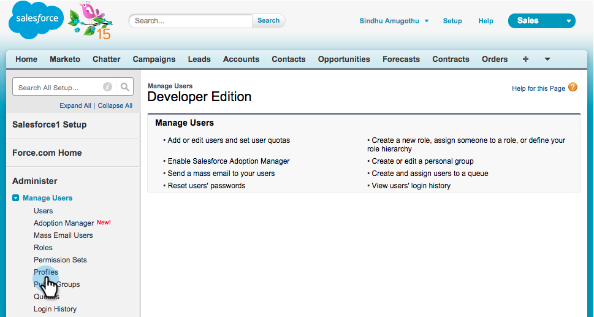

# Instalar e Configurar o [!DNL Marketo Sales Insight] no [!DNL Salesforce1] {#install-and-configure-marketo-sales-insight-in-salesforce}

>[!NOTE]
>
>Clientes existentes, [Atualize seu pacote MSI](/help/marketo/product-docs/marketo-sales-insight/msi-for-salesforce/upgrading/upgrading-your-msi-package.md) antes de continuar!

>[!PREREQUISITES]
>
>Se você tiver o Salesforce Enterprise/Unlimited:
>
>* [Etapa 1 de 3: Adicionar Campos do Marketo a [!DNL Salesforce] (Empresarial/Ilimitada)](/help/marketo/product-docs/crm-sync/salesforce-sync/setup/enterprise-unlimited-edition/step-1-of-3-add-marketo-fields-to-salesforce-enterprise-unlimited.md)
>* [Etapa 2 de 3: Criar um [!DNL Salesforce] Usuário para Marketo (Enterprise/Unlimited)](/help/marketo/product-docs/crm-sync/salesforce-sync/setup/enterprise-unlimited-edition/step-2-of-3-create-a-salesforce-user-for-marketo-enterprise-unlimited.md)
>* [Etapa 3 de 3: Conectar o Marketo e [!DNL Salesforce] (Empresa/Ilimitado)](/help/marketo/product-docs/crm-sync/salesforce-sync/setup/enterprise-unlimited-edition/step-3-of-3-connect-marketo-and-salesforce-enterprise-unlimited.md)
>* [Configurar [!DNL Marketo Sales Insight] em [!DNL Salesforce] Empresa/Ilimitado](/help/marketo/product-docs/marketo-sales-insight/msi-for-salesforce/configuration/configure-marketo-sales-insight-in-salesforce-enterprise-unlimited.md)
>
>Se você tiver o Salesforce Professional:
>
>* [Configurar o Marketo Sales Insight no Salesforce Professional Edition](/help/marketo/product-docs/marketo-sales-insight/msi-for-salesforce/configuration/configure-marketo-sales-insight-in-salesforce-professional-edition.md)
>

>[!NOTE]
>
>[!DNL Marketo Sales Insight] em [!DNL Salesforce1] inclui: [!DNL BMelhores Opções], Feed de Cliente Potencial, Momentos Interessantes e Adicionar ao Marketo Campaign.

## Habilitar o Aplicativo Móvel [!DNL Salesforce1] {#enable-the-salesforce1-mobile-app}

1. Clique em **[!DNL Setup]** e depois em **[!DNL Mobile Administration]**.

   

1. Clique em **[!UICONTROL Salesforce1]**.

   

1. Clique em **[!UICONTROL Configurações do Salesforce1]**.

   

1. Clique em **[!UICONTROL Habilitar o aplicativo Salesforce1 para navegador móvel]**.

   

1. Clique em **[!UICONTROL Salvar]**.

   

1. Selecione **[!UICONTROL Administração do Mobile]**.

   

1. Clique em **[!UICONTROL Gerenciar o menu de navegação móvel]**.

   

1. Selecione **[!UICONTROL Marketo]** e **[!UICONTROL Adicionar]** aos itens de menu **[!UICONTROL Selecionados]**.

   

1. Selecione **[!UICONTROL Marketo]**, mova-o **[!UICONTROL Para cima]** para uma área desejada e clique em **[!UICONTROL Salvar]**.

   

## Ocultar objeto personalizado desatualizado do Marketo {#hide-outdated-marketo-custom-object}

1. Clique em **[!UICONTROL Instalação]**.

   

1. Selecione **[!UICONTROL Gerenciar Usuários]**.

   

1. Selecione **[!UICONTROL Perfis]**.

   

1. Clique para **[!UICONTROL Editar]** os perfis desejados.

   

1. Em **[!UICONTROL Configurações da Guia]**, selecione o _primeiro_ **[!UICONTROL Marketo]**.

   

1. Selecione **[!UICONTROL Guia Oculta]**.

   

   >[!NOTE]
   >
   >Oculte a guia Marketo para todos os perfis desejados.

## Personalizar guias {#customize-tabs}

1. Clique em **+**.

   

1. Clique em **[!UICONTROL Personalizar minhas guias]**.

   

1. Selecione o **[!UICONTROL Marketo]** e **[!UICONTROL Adicionar]** às Guias Selecionadas.

   

1. Selecione **[!UICONTROL Marketo]**, mova-o **[!UICONTROL Para cima]** para uma área desejada e clique em **[!UICONTROL Salvar]**.

   

## Personalizar Layouts de Página {#customize-page-layouts}

1. Clique em **[!UICONTROL Instalação]**.

   

1. Clique em **[!UICONTROL Configuração]**, digite **[!UICONTROL Layouts de Página]** e clique em **[!UICONTROL Layouts de Página]** em Clientes Potenciais.

   >[!NOTE]
   >
   >Repita as etapas para cada Layout de página que sua organização usa (marketing, vendas etc.) para objetos de Contato, Conta e Oportunidade.

   

1. Clique em **[!UICONTROL Editar]** para fazer alterações no Layout de Cliente Potencial.

   

1. Clique em **[!UICONTROL Visualforce Pages]** e arraste **[!UICONTROL Lead Mobile]** para a seção Cartões Móveis.

   

1. Altere a Altura para 66 e clique em **[!UICONTROL OK]**.

   

1. Clique em **[!UICONTROL Campos]** e arraste **[!UICONTROL Adicionar ao Marketo Campaign]** para a seção **[!UICONTROL Marketo Sales Insight]**.

   

   >[!TIP]
   >
   >Digite &quot;Adicionar a&quot; na Localização rápida para facilitar a localização de Adicionar ao Marketo Campaign.

1. Clique em **[!UICONTROL Salvar]**.

   

Ufa! Você acabou de instalar o [!DNL Marketo Sales Insight] para [!DNL Salesforce1]! Vá em frente e dê um tapinha nas costas.

>[!MORELIKETHIS]
>
>* [[!DNL Best Bets] em [!DNL Salesforce1]](/help/marketo/product-docs/marketo-sales-insight/msi-for-salesforce/msi-for-mobile/best-bets-in-salesforce1.md)
>* [Momentos interessantes em [!DNL Salesforce1]](/help/marketo/product-docs/marketo-sales-insight/msi-for-salesforce/msi-for-mobile/interesting-moments-in-salesforce1.md)
>* [Enviar emails do Marketo e ações do Campaign e da Lista de favoritos em [!DNL Salesforce1]](/help/marketo/product-docs/marketo-sales-insight/msi-for-salesforce/msi-for-mobile/send-marketo-email-and-campaign-and-watchlist-actions-in-salesforce1.md)
