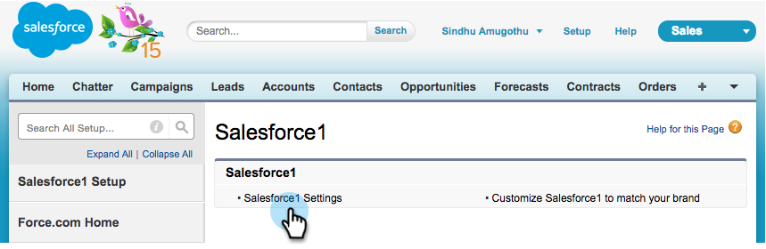

# Instalar e configurar o Marketo Sales Insight no Salesforce1 {#install-and-configure-marketo-sales-insight-in-salesforce}

>[!NOTE]
>
>Clientes existentes, [Atualize seu pacote MSI](/help/marketo/product-docs/marketo-sales-insight/msi-for-salesforce/upgrading/upgrading-your-msi-package.md) antes de continuar!

>[!PREREQUISITES]
>
>Se você tiver o Salesforce Enterprise/Unlimited:
>
>* [Etapa 1 de 3: adicionar campos do Marketo ao Salesforce (Enterprise/Unlimited)](/help/marketo/product-docs/crm-sync/salesforce-sync/setup/enterprise-unlimited-edition/step-1-of-3-add-marketo-fields-to-salesforce-enterprise-unlimited.md)
>* [Etapa 2 de 3: Criar um usuário do Salesforce para Marketo (Enterprise/Unlimited)](/help/marketo/product-docs/crm-sync/salesforce-sync/setup/enterprise-unlimited-edition/step-2-of-3-create-a-salesforce-user-for-marketo-enterprise-unlimited.md)
>* [Etapa 3 de 3: Conectar Marketo e Salesforce (Enterprise/Unlimited)](/help/marketo/product-docs/crm-sync/salesforce-sync/setup/enterprise-unlimited-edition/step-3-of-3-connect-marketo-and-salesforce-enterprise-unlimited.md)
>* [Configurar o Marketo Sales Insight no Salesforce Enterprise/Unlimited](/help/marketo/product-docs/marketo-sales-insight/msi-for-salesforce/configuration/configure-marketo-sales-insight-in-salesforce-enterprise-unlimited.md)
>
>Se você tiver o Salesforce Professional:
>
>* [Configurar o Marketo Sales Insight no Salesforce Professional Edition](/help/marketo/product-docs/marketo-sales-insight/msi-for-salesforce/configuration/configure-marketo-sales-insight-in-salesforce-professional-edition.md)
>

>[!NOTE]
>
>O Marketo Sales Insight no Salesforce1 inclui: Melhores opções, Feed de clientes potenciais, Momentos interessantes e Adicionar ao Marketo Campaign.

## Habilitar o aplicativo móvel Salesforce1 {#enable-the-salesforce1-mobile-app}

1. Clique em **Configuração** e depois em **Administração Móvel**.

   

1. Clique em **Salesforce1**.

   

1. Clique em **Configurações do Salesforce1**.

   

1. Clique em **Habilitar o aplicativo para navegador móvel Salesforce1**.

   

1. Clique em **Salvar**.

   

1. Selecione **Administração do Mobile**.

   

1. Clique em **Gerenciar o menu de navegação móvel**.

   

1. Selecione **Marketo** e **Adicionar** aos itens de menu **Selecionados**.

   

1. Selecione **Marketo**, mova-o **Para cima** para uma área desejada e clique em **Salvar**.

   

## Ocultar objeto personalizado desatualizado do Marketo {#hide-outdated-marketo-custom-object}

1. Clique em **Instalação**.

   

1. Selecione **Gerenciar Usuários**.

   

1. Selecione **Perfis**.

   

1. Clique para **editar** os perfis desejados.

   

1. Em **Configurações da Guia**, selecione o _primeiro_ **Marketo**.

   

1. Selecione **Guia Oculta**.

   

   >[!NOTE]
   >
   >Oculte a guia Marketo para todos os perfis desejados.

## Personalizar guias {#customize-tabs}

1. Clique em **+**.

   

1. Clique em **Personalizar minhas guias**.

   

1. Selecione o **Marketo** e **Adicionar** às Guias Selecionadas.

   

1. Selecione **Marketo**, mova-o **Para cima** para uma área desejada e clique em **Salvar**.

   

## Personalizar Layouts de Página {#customize-page-layouts}

1. Clique em **Instalação**.

   

1. Clique em **Configuração**, digite **Layouts de Página** e clique em **Layouts de Página** em Clientes Potenciais.

   >[!NOTE]
   >
   >Repita as etapas para cada Layout de página que sua organização usa (marketing, vendas etc.) para objetos de contato, conta e oportunidade.

   

1. Clique em **Editar** para fazer alterações no Layout de Cliente Potencial.

   

1. Clique em **Visualforce Pages** e arraste **Lead Mobile** para a seção Cartões Móveis.

   

1. Altere a Altura para 66 e clique em **OK**.

   

1. Clique em **Campos** e arraste **Adicionar ao Marketo Campaign** para a seção **Marketo Sales Insight**.

   

   >[!TIP]
   >
   >Digite &quot;Adicionar a&quot; na Localização rápida para facilitar a localização de Adicionar ao Marketo Campaign.

1. Clique em **Salvar**.

   

Ufa! Você acabou de instalar o Marketo Sales Insight for Salesforce1! Vá em frente e dê um tapinha nas costas.

>[!MORELIKETHIS]
>
>* [Melhores Opções no Salesforce1](/help/marketo/product-docs/marketo-sales-insight/msi-for-salesforce/msi-for-mobile/best-bets-in-salesforce1.md)
>* [Momentos interessantes no Salesforce1](/help/marketo/product-docs/marketo-sales-insight/msi-for-salesforce/msi-for-mobile/interesting-moments-in-salesforce1.md)
>* [Enviar email do Marketo e ações do Campaign e da Lista de favoritos no Salesforce1](/help/marketo/product-docs/marketo-sales-insight/msi-for-salesforce/msi-for-mobile/send-marketo-email-and-campaign-and-watchlist-actions-in-salesforce1.md)
