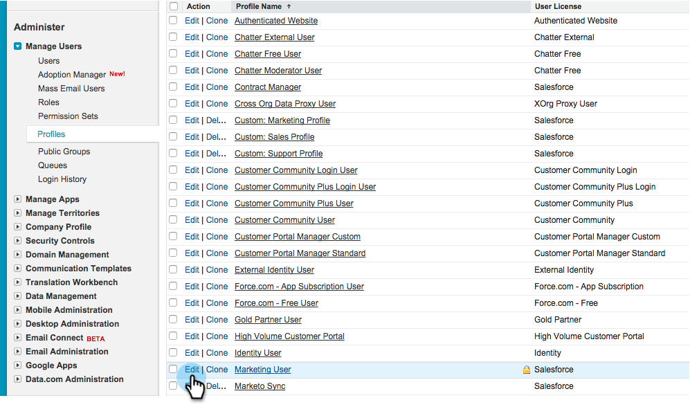

# Instalar e configurar o Marketingto Sales Insight no Salesforce1 {#install-and-configure-marketo-sales-insight-in-salesforce}

>[!NOTE]
>
>**Lembrete**
>
>Clientes existentes, [Atualize seu pacote MSI](http://docs.marketo.com/x/_gU6Ag) antes de continuar!

>[!PREREQUISITES]
>
>Se você tiver o Salesforce Enterprise/Unlimited:
>
>* [Etapa 1 de 3: Adicionar campos de marketing ao Salesforce (Enterprise/Unlimited)](../../../../product-docs/crm-sync/salesforce-sync/setup/enterprise-unlimited-edition/step-1-of-3-add-marketo-fields-to-salesforce-enterprise-unlimited.md)
>* [Etapa 2 de 3: Criar um usuário do Salesforce para o Marketing (Enterprise/Unlimited)](../../../../product-docs/crm-sync/salesforce-sync/setup/enterprise-unlimited-edition/step-2-of-3-create-a-salesforce-user-for-marketo-enterprise-unlimited.md)
>* [Etapa 3 de 3: Connect Marketing e Salesforce (Enterprise/Unlimited)](../../../../product-docs/crm-sync/salesforce-sync/setup/enterprise-unlimited-edition/step-3-of-3-connect-marketo-and-salesforce-enterprise-unlimited.md)
>* [Configurar o Marketing to Sales Insight no Salesforce Enterprise/Unlimited](../../../../product-docs/marketo-sales-insight/msi-for-salesforce/configuration/configure-marketo-sales-insight-in-salesforce-enterprise-unlimited.md)

>
>
Se você tiver o Salesforce Professional:
>
>* [Configurar o Marketing Sales Insight no Salesforce Professional Edition](../../../../product-docs/marketo-sales-insight/msi-for-salesforce/configuration/configure-marketo-sales-insight-in-salesforce-professional-edition.md)

>

>[!NOTE]
>
>O Marketing to Sales Insight no Salesforce1 inclui: Melhores apostas, feed principal, momentos interessantes e Campanha Adicionar ao marketing.

1. Ativar o aplicativo móvel Salesforce1
1. Clique em **Configuração** e em **Administração Móvel**.

   

1. Clique em **Salesforce1**.

   

1. Clique em **Configurações do Salesforce1**.

   

1. Clique em **Ativar o aplicativo do navegador móvel Salesforce1**.

   

1. Clique em **Salvar**.

   

1. Selecione **Administração móvel**.

   

1. Clique em **Gerenciar o menu de navegação móvel**.

   

1. Selecione **Marketo **e **Adicionar **it aos **itens de menu selecionados **do.

   

1. Selecione **Marketo**, mova-o **Up **para uma área desejada e clique em **Salvar**.

   

1. Ocultar objeto personalizado Marketo desatualizado
1. Clique em **Configuração**.

   

1. Selecione **Gerenciar usuários**.

   

1. Selecione **Perfis**.

   

1. Clique para **editar **qualquer perfil desejado.

   

1. Em **Configurações de tabulação**, selecione *first* **Marketo**.

   ** 

   **

1. Selecione **Tabulação oculta**.

   ** 

   **

   >[!NOTE]
   >
   >Certifique-se de ocultar a guia Marketo para todos os perfis desejados!

1. Personalizar guias
1. Clique em** +**.

   

1. Clique em **Personalizar minhas guias**.

   

1. Selecione **Marketo** e **Add **it para as guias selecionadas.

   

1. Selecione **Marketo**, mova-o **Up **para uma área desejada e clique em **Salvar**.

   

1. Personalizar layouts de página
1. Clique em **Configuração**.

   

1. Clique em **Configuração**, digite **Layouts de página** e clique em **Layouts de página** em Clientes potenciais.

   >[!NOTE]
   >
   >Repita as etapas para cada Layout de página que sua organização usa (marketing, vendas etc.) para objetos de Contato, Conta e Oportunidade.

   

1. Clique em **Editar** para fazer alterações no Layout principal.

   

1. Clique em **Visualforce Pages **e arraste** Lead Mobile **para a seção Mobile Cards.

   

1. Altere a Altura para 66 e clique em **OK**.

   

1. Clique em **Campos** e arraste **Adicionar à Campanha de marketing **para a seção** Marketing to Sales Insight **s.

   

   >[!TIP]
   >
   >Digite &quot;Adicionar a&quot; na Localização Rápida para facilitar a localização da Campanha Adicionar ao Marketing.

1. Clique em **Salvar**.

   

Ufa! Finalmente, você terminou de instalar o Marketing Insight Sales para Salesforce1! Vá em frente e dê um tapinha nas costas.

>[!MORELIKETHIS]
>
>* [Melhores apostas no Salesforce1](best-bets-in-salesforce1.md)
>* [Momentos interessantes em Salesforce1](interesting-moments-in-salesforce1.md)
>* [Enviar ações de Campanha e email para marketing e lista de vigias no Salesforce1](send-marketo-email-and-campaign-and-watchlist-actions-in-salesforce1.md)

>

