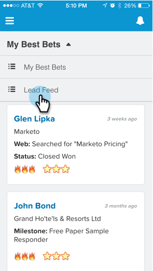

# Vendo o Feed de Cliente Potencial em [!DNL Salesforce1] {#seeing-lead-feed-in-salesforce}

O Feed de lead é uma lista atualizada por minuto de eventos interessantes feitos por seus leads.

1. Vá para a área **Marketo** em [!DNL Salesforce1].

   

1. Toque na seta para baixo.

   

1. Toque Em **[!UICONTROL Feed Principal]**.

   

   Perfeito! Agora você sabe como acessar o seu Feed principal!

   

>[!MORELIKETHIS]
>
>* [Momentos interessantes em [!DNL Salesforce1]](/help/marketo/product-docs/marketo-sales-insight/msi-for-salesforce/msi-for-mobile/interesting-moments-in-salesforce1.md)
>* [Enviar emails do Marketo e ações do Campaign e da Lista de favoritos em [!DNL Salesforce1]](/help/marketo/product-docs/marketo-sales-insight/msi-for-salesforce/msi-for-mobile/send-marketo-email-and-campaign-and-watchlist-actions-in-salesforce1.md)
>* [[!DNL Best Bets] em [!DNL Salesforce1]](/help/marketo/product-docs/marketo-sales-insight/msi-for-salesforce/msi-for-mobile/best-bets-in-salesforce1.md)
