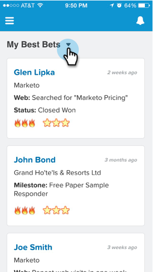

# Visualização do feed de informação privilegiada no Salesforce1 {#seeing-lead-feed-in-salesforce}

O Feed de lead é uma lista atualizada de eventos interessantes feitos por seus leads.

1. Vá para o **Marketo** área em Salesforce1.

   

1. Toque na seta para baixo.

   

1. Toque **Feed de lead**.

   

   Perfeita! Agora você sabe como chegar ao seu Feed de lead!

   

>[!MORELIKETHIS]
>
>* [Momentos interessantes em Salesforce1](/help/marketo/product-docs/marketo-sales-insight/msi-for-salesforce/msi-for-mobile/interesting-moments-in-salesforce1.md)
>* [Enviar email do Marketo e ações de campanha e lista de favoritos no Salesforce1](/help/marketo/product-docs/marketo-sales-insight/msi-for-salesforce/msi-for-mobile/send-marketo-email-and-campaign-and-watchlist-actions-in-salesforce1.md)
>* [Melhores vantagens no Salesforce1](/help/marketo/product-docs/marketo-sales-insight/msi-for-salesforce/msi-for-mobile/best-bets-in-salesforce1.md)

