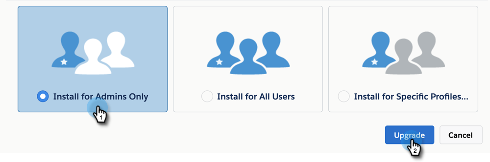

# Atualização do pacote MSI {#upgrading-your-msi-package}

>[!IMPORTANT]
>
>Devido aos aprimoramentos de segurança feitos pelo Salesforce, o pacote Sales Insight não pode mais conceder permissão a objetos padrão. Além disso, o perfil Salesforce de usuários do Sales Insight precisará ter acesso de leitura aos seguintes objetos padrão: cliente em potencial, contato, conta e oportunidade. [Saiba como configurar isso aqui](/help/marketo/product-docs/marketo-sales-insight/msi-for-salesforce/configuration/configure-marketo-sales-insight-in-salesforce-professional-edition.md#grant-sales-insight-users-profile-access){target="_blank"}.

1. Navegue até [esta página no appexchange](https://appexchange.salesforce.com/listingDetail?listingId=a0N30000001SVZmEAO){target="_blank"}.

1. Faça logon na instância do [!DNL Salesforce] (aquela conectada à instância do Marketo, pode ser sandbox ou produção) no canto superior direito na página da Etapa Um. Você deve ter privilégios de Administrador para instalar/atualizar um pacote gerenciado em [!DNL Salesforce].

1. Clique no botão **Obter Agora**. Você será solicitado a escolher onde deseja instalar. Você terá a opção de atualizar, pois já tem uma versão anterior do MSI. Escolha uma opção com base na conta à qual você fez logon durante a Etapa Um.

   >[!TIP]
   >
   >Recomendamos testar isso na instância da sandbox antes de atualizar a instância de produção.

1. Você pode atualizar o pacote escolhendo &quot;Instalar somente para administradores&quot; (e fornecer acesso MSI a perfis específicos posteriormente), &quot;Instalar para todos os usuários&quot; ou &quot;Instalar para perfis específicos&quot;. Neste exemplo, estamos escolhendo Somente administradores. Depois de fazer sua seleção, clique em **Atualizar**.

   

>[!NOTE]
>
>É recomendável atualizar o pacote somente para Administradores e, em seguida, [fornecer acesso a usuários específicos](/help/marketo/product-docs/marketo-sales-insight/msi-for-salesforce/configuration/add-sales-insight-access-to-profiles.md){target="_blank"} com base no número de vagas MSI adquiridas. Como alternativa, você pode criar um perfil do Salesforce específico para usuários MSI e instalar ou atualizar o pacote somente para esses usuários.
