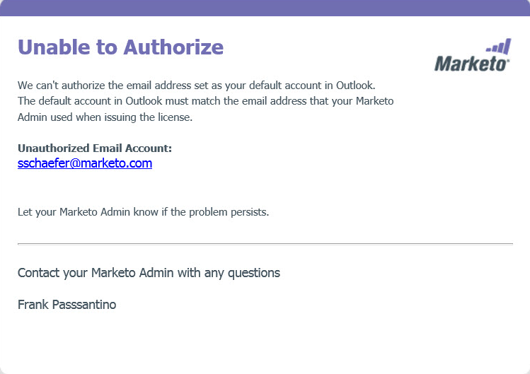

# Autorizar o plug-in [!DNL Outlook] do Marketo {#authorize-the-marketo-outlook-plugin}

Para usar o plug-in MSI do Marketo em [!DNL Outlook], é necessário autorizá-lo.

>[!PREREQUISITES]
>
>O plug-in já deve estar instalado e você deve ser autorizado como usuário de plug-in pelo administrador do Marketo.

>[!IMPORTANT]
>
>A Microsoft lançou uma [nova versão do Outlook para Windows](https://techcommunity.microsoft.com/t5/outlook-blog/new-outlook-for-windows-now-available/ba-p/3932068){target="_blank"}. Esta nova versão não oferece suporte ao plug-in MSI Outlook existente. O plug-in MSI Outlook continuará a funcionar para áreas de trabalho do Windows que executam a versão clássica do Outlook. Para saber mais sobre o novo Outlook para Windows para organizações, [clique aqui](https://techcommunity.microsoft.com/t5/outlook-blog/the-new-outlook-for-windows-for-organization-admins/ba-p/3929169){target="_blank"}.

1. Clique em qualquer um dos botões de Mensagem Marketo.

   

1. Quando a caixa de diálogo [!UICONTROL Autorizar plug-in do Marketo] for exibida, clique em **[!UICONTROL Solicitar código]**.

   

1. O código é enviado para o seu endereço de email padrão da conta [!DNL Outlook].

   

1. Se o email da sua conta padrão [!DNL Outlook] for verificado, você receberá uma chave de registro. Insira-o na janela pop-up e clique em **[!UICONTROL Enviar]**.

   

   >[!NOTE]
   >
   >O código de registro **expira após 14 dias.**

1. Se o endereço de email não estiver autorizado, você receberá esse email menos feliz. Entre em contato com o administrador do Marketo para resolver o problema.

   
