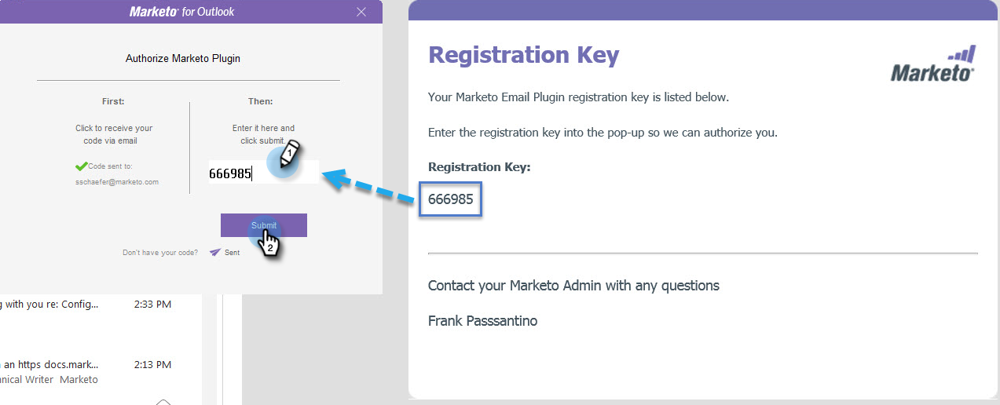

# Autorizar o plug-in do Marketing to Outlook {#authorize-the-marketo-outlook-plugin}

Para usar o plug-in MSI do Marketo no Outlook, é necessário autorizá-lo.

>[!PREREQUISITES]
>
>O plug-in já deve estar instalado e você deve ser autorizado como um usuário de plug-in pelo Administrador do Marketing.

1. Clique em um dos botões Mensagem de marketing.

   

1. Quando a caixa de diálogo Autorizar plug-in de marketing for exibida, clique em **Solicitar código**.

   

1. O código é enviado para seu endereço de email padrão de conta do Outlook.

   

1. Se o endereço de email padrão da sua conta do Outlook sair, você receberá uma chave de registro. Insira-o no pop-up e clique em **Enviar**.

   

   >[!NOTE]
   >
   >O código de registro **expira após 14 dias.**

1. Se o endereço de email não estiver autorizado, você receberá esse email menos feliz. Entre em contato com o administrador do Marketing para resolver o problema.

   

